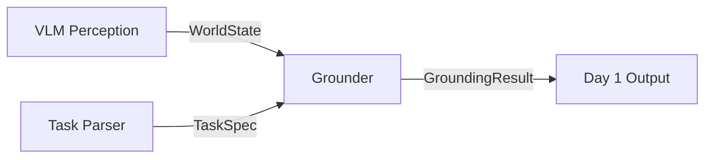

# day1 diagram

```mermaid
flowchart LR
    Perception[VLM Perception]
    TaskParser[Task Parser]
    Grounder[Grounder]

    Perception -->|WorldState| Grounder
    TaskParser -->|TaskSpec| Grounder
    Grounder -->|GroundingResult| Output[Day 1 Output]
```
