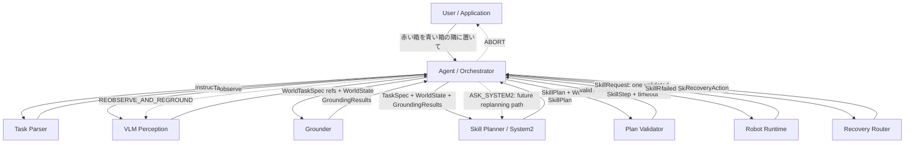
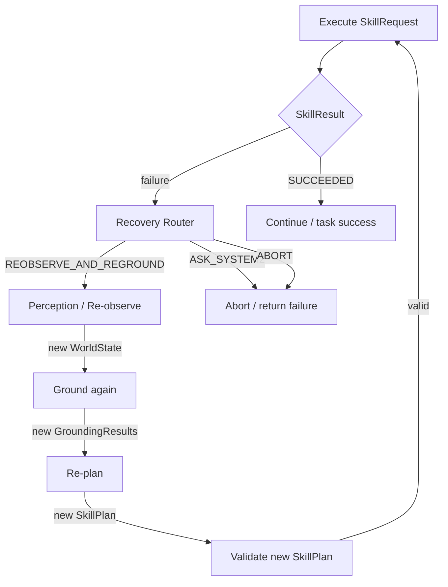
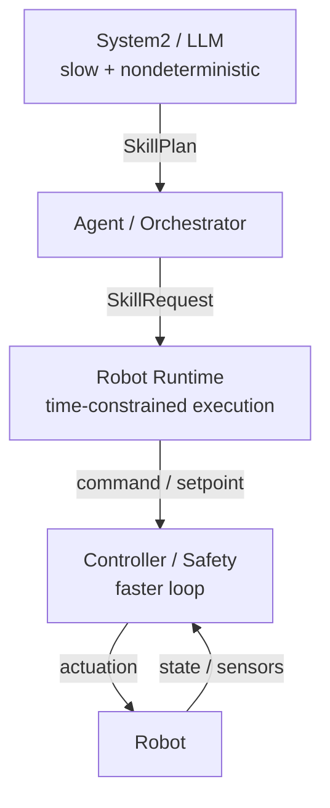

# Day 2 diagram

## System architecture



- Task Parser = WHAT
- Perception = WHAT EXISTS
- Grounder = WHICH ENTITY
- Skill Planner / System2 = WHICH SKILLS / IN WHAT ORDER
- Plan Validator = CAN THIS PLAN BE EXECUTED AGAINST THE CURRENT WORLD STATE?
- Robot Runtime = EXECUTE ONE SKILL REQUEST
- Recovery Router = WHAT TO DO AFTER FAILURE
- Agent = ORCHESTRATION / CLOSED-LOOP EXECUTION

## Main data contracts

```text
TaskSpec
  -> user's goal; retained across REOBSERVE_AND_REGROUND

WorldState
  -> current observed world; discarded and rebuilt after re-observation

GroundingResults
  -> one result per requested ref
  -> RESOLVED / NOT_FOUND / AMBIGUOUS

SkillPlan
  -> ordered SkillSteps produced by System2
  -> e.g. PICK(obj_0) -> PLACE(obj_0, NEXT_TO, obj_2)

SkillRequest
  -> one SkillStep + runtime metadata (currently timeout_sec)
  -> Agent dispatches requests one step at a time

SkillResult
  -> SUCCEEDED / PRECONDITION_FAILED / FAILED / TIMEOUT / CANCELLED
  -> includes a reason used by Recovery Router

RecoveryAction
  -> REOBSERVE_AND_REGROUND / ASK_SYSTEM2 / ABORT
```

## Recovery loop implemented in Day 2



`REOBSERVE_AND_REGROUND` is implemented as a bounded retry loop (`max_retries`).
`ASK_SYSTEM2` is routed but full failure-aware System2 replanning is deferred.

## Timing boundary / RT mini-lab



Day 2 RT mini-lab used a 100 Hz (10 ms) best-effort Python loop with absolute scheduling.
Measured quantities were loop period, execution time, scheduling jitter, and deadline misses.
Under CPU load, the long-term mean period stayed near 10 ms while individual periods and maximum jitter increased. This demonstrates that an average 100 Hz rate is not a real-time guarantee.

The architectural consequence is that slow, variable-latency System2/LLM work must not sit inside a time-constrained robot/control loop. The boundary is expressed through coarse-grained `SkillPlan` / `SkillRequest` interfaces instead.
