# Physical AI Hands-on Textbook

VLMによる知覚からskill planning、Robot Runtime、robot learning、recovery、安全境界までを、小さな実験を通して学ぶDay 1〜5の教材です。

> [!WARNING]
> このリポジトリは教育・研究目的の実験的なソフトウェアです。安全認証を受けた制御システムではありません。現在のRobot Runtimeはfake実装であり、実機に必要な速度・力・衝突制限、非常停止などのruntime/control safetyは実装していません。

## この教材について

### 想定読者

- Pythonの基本的なコードを読める人
- LLM/VLMをロボットシステムへ組み込む際の責務分離を学びたい人
- 実機を用意する前に、software architectureを小さな例で確認したい人

PyTorch、Pydantic、ロボティクスの基礎知識があると読みやすくなりますが、ROS 2や実機はこの教材の実行に必須ではありません。

### 学習ロードマップ

| Day | テーマ | 到達点 |
|---|---|---|
| 1 | VLM・Grounding・Structured World Model | 自然言語と画像を明示的なschemaへ変換する |
| 2 | System 2・Skill Planning・Robot Runtime | semantic reasoningと実行境界を分離する |
| 3 | Robot Learning・VLA・Action Chunking | learned policyをskill境界の内側に位置付ける |
| 4 | Hybrid Physical AI・System 1 Recovery | failure observationからbounded recoveryを選ぶ |
| 5 | Safety・Failure Injection・Evaluation | request-level safetyと評価の限界を理解する |

### 読み方と実行方法

本文は、学習時に行った実験から得た設計上の知見を再構成したものです。会話履歴を知らなくても読めるよう、各Dayの冒頭に関連コードを示します。環境構築、APIキー、再現用sceneの生成、実行コマンドは[リポジトリのREADME](../README.md)を参照してください。

外部APIを使う実験の出力やlatencyは、model、network、地域、実行時期によって変化します。本文中の数値は特定時点の小規模な観測例であり、一般的な性能や再現値を保証するものではありません。

### 表記

本文では、コード上の型名（`WorldState`など）と分野で一般的な略語（VLM、VLA、ACTなど）は英語表記を維持します。主な用語は初出時に説明します。

- **LLM**: Large Language Model
- **VLM**: Vision-Language Model
- **VLA**: Vision-Language-Action model
- **Grounding**: 自然言語の参照を具体的なentityへ対応付ける処理
- **System 2**: 長い時間スケールでsemantic reasoningや計画を行うcomponent
- **System 1**: この教材では、限定された候補から状況依存の判断を行うcomponent
- **Robot Runtime**: 上位のskill requestを実行系へ接続するsoftware boundary

---

## Day 1 — VLM・Grounding・Structured World Model

### 1. この章のゴール

関連コード：[`day1/`](../day1/)、[`world_state.py`](../physical_ai/world_state.py)、[`grounder.py`](../physical_ai/grounder.py)、[`task_parser.py`](../physical_ai/task_parser.py)

Physical AIでは、VLMやLLMの出力をそのままロボットの制御入力として使うのではなく、ロボットシステムが扱える**明示的なデータ構造**へ変換することが重要です。

Day 1では、次の流れを構築します。

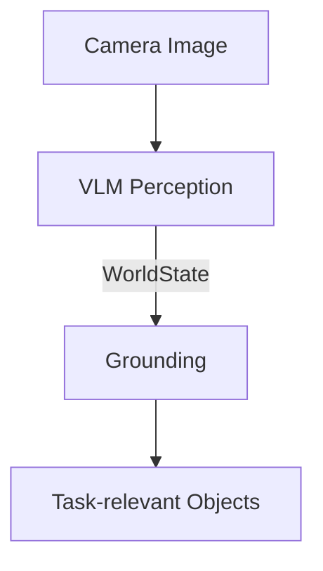

同時に、自然言語の指示を次のように構造化します。

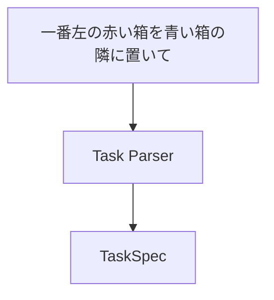

最終的には、

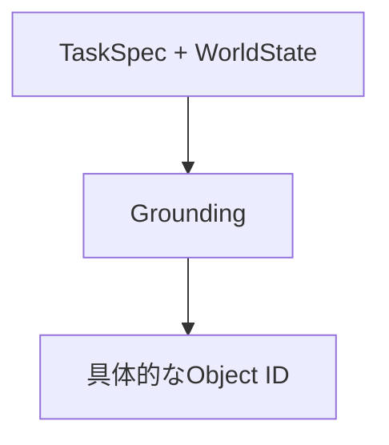

まで変換できることを目標とします。

---

### 2. VLMをロボットの知覚に使う

VLM（Vision-Language Model）は、画像を単に分類するだけでなく、

- 何が存在するか
- どんな属性を持つか
- おおよそどこにあるか
- 自然言語で指定された対象がどれか

といったsemanticな情報を取得できます。

例えば画像から、

```text
赤い箱
青い箱
黒い障害物
```

を認識できます。

しかし、ロボットシステムの内部表現として自由文を使うのは扱いづらいため、VLMの結果を`WorldState`へ変換します。

```python
class WorldState(BaseModel):
    objects: list[WorldObject]
```

各objectには、

```text
id
type
color
bounding box
```

などを持たせます。

#### ポイント

VLMは**semantic perception**として使い、後段のsoftwareが扱いやすいstructured dataへ変換します。

---

### 3. Structured Output

LLM/VLMにJSONを「それっぽく」生成させるだけでは、fieldの欠落や型の違いが発生します。

そこでStructured OutputとPydantic schemaを利用します。

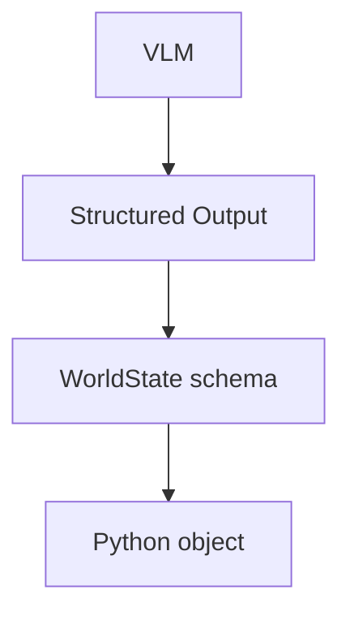

これにより、

```text
colorは定義されたEnumのみ
bboxにはcenter / width / heightが必要
width / heightは正の値
```

といった構造上の制約を持たせられます。

ただし重要なのは、

> **Schema valid ≠ Semantically correct**

という点です。

例えば、

```json
{
  "color": "red",
  "x": 500
}
```

がschema上正しくても、本当に画像上の赤い箱がその位置にあるとは限りません。

Structured OutputはAIの出力を**安全に扱いやすくする仕組み**であって、認識そのものの正しさを保証するものではありません。

---

### 4. VLMとGeometry

VLMはbounding boxやobject centerを推定できます。

この教材で単純な図形sceneを観測した例では、

- object centerは比較的正確
- bounding boxはおおよその位置として使える
- object形状によってwidth / heightの誤差が生じる

といった傾向が見られました。ただし、これは特定のmodelと小規模な入力による観測であり、一般的な精度評価ではありません。

したがってVLMのgeometryは、

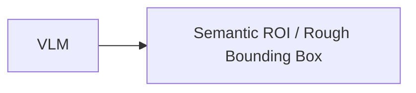

として扱うのが安全です。

精密なロボット操作では、

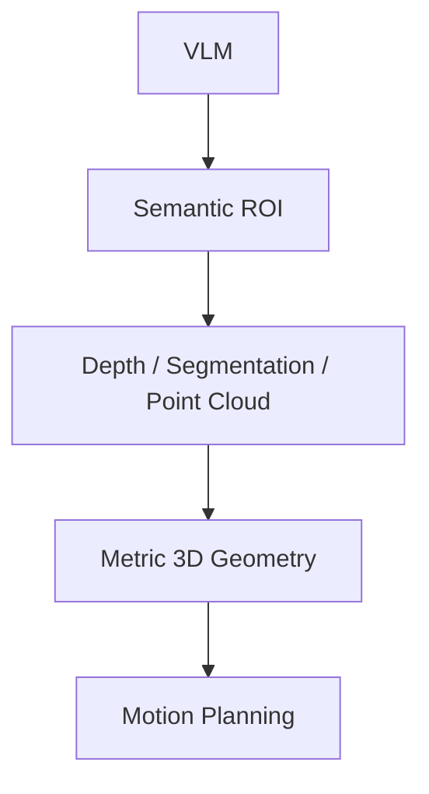

のように、後段のperceptionと組み合わせます。

#### Coordinate Contract

位置を扱うときは、

```text
pixel coordinateなのか
normalized coordinateなのか
camera frameなのか
world frameなのか
```

を明示する必要があります。

数値だけを渡す設計は、ROSで`frame_id`なしの座標を渡すのと同じ問題を持ちます。

---

### 5. TaskSpec

ユーザーの自然言語指示も、そのまま後段へ渡さずstructured representationへ変換します。

例えば、

```text
"赤い箱を青い箱の隣に置いて"
```

を、

```text
action     = PLACE
object_ref = "赤い箱"
target_ref = "青い箱"
relation   = NEXT_TO
```

という`TaskSpec`へ変換します。

ここで重要なのは、`TaskSpec`のreferenceはまだ、

```text
"赤い箱"
```

という**semantic reference**だということです。

まだ具体的な`obj_3`などには変換しません。

---

### 6. Grounding

Groundingは、

> 自然言語上のreferenceを、WorldState上の具体的なentityへ対応付ける

処理です。

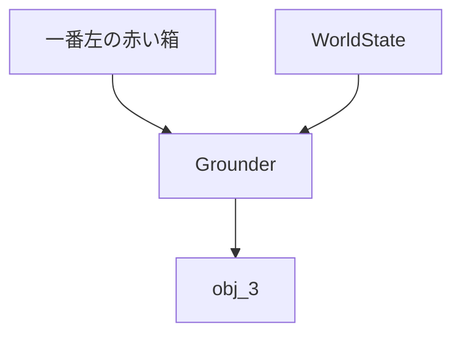

Grounding結果には少なくとも、

```text
RESOLVED
NOT_FOUND
AMBIGUOUS
```

を持たせます。

例えば、

```text
赤い箱が1個
→ RESOLVED

赤い箱が存在しない
→ NOT_FOUND

赤い箱が2個あり区別できない
→ AMBIGUOUS
```

となります。

Groundingできなかった場合は、後段のPlannerへ進ませないことが重要です。

---

### 7. Object Identity

VLMが検出したobjectにstable IDを持たせる責務は、本来VLMにはありません。

実システムでは、

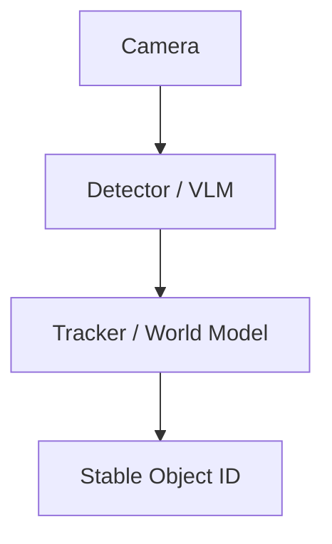

という構成が考えられます。

つまり、

```text
Perception = WHAT EXISTS
Grounding   = WHICH ENTITY
Tracking    = WHICH PHYSICAL OBJECT OVER TIME
```

は別の問題です。

簡単なlabでは検出後に`obj_0`, `obj_1`などを割り当てても構いませんが、それがframe間でstableではないことを理解しておく必要があります。

---

### 8. Grounding Contract

Grounderは、要求されたreferenceごとに結果を返すようにします。

```text
Input:
  "一番左の赤い箱"
  "青い箱"

Output:
  "一番左の赤い箱" → RESOLVED(obj_0)
  "青い箱"         → NOT_FOUND
```

各結果に元の`ref`を持たせることで、

```text
requested refs
      ==
returned refs
```

をdeterministicに検証できます。

これはLLMをrobotics systemへ組み込むときの基本原則につながります。

```text
Prompt
  ↓
期待するbehaviorを伝える

Schema
  ↓
出力構造を制約する

Validator
  ↓
システム上必要なsemantic invariantを検証する
```

---

### 9. Day 1 Architecture

Day 1終了時点では、次の責務分離になります。

```text
                    ┌─────────────┐
Instruction ───────▶│ Task Parser │
                    └──────┬──────┘
                           │ TaskSpec
                           ▼

Image ─────────────▶ VLM Perception
                           │
                           │ WorldState
                           ▼
                       Grounder
                           ▲
                           │ semantic refs
                           │
                        TaskSpec
                           │
                           ▼
                   GroundingResults
```

#### Day 1で覚えておくこと

1. VLMの自由文をそのままrobot systemへ渡さない
2. Structured Outputで明示的なcontractを作る
3. Schema validityとsemantic correctnessを区別する
4. VLM geometryはrough semantic geometryとして扱う
5. Task ParsingとGroundingを分離する
6. Stable identityはTracker / World Modelの責務
7. AI outputの後にはdeterministic validationを置く

---

## Day 2 — System 2・Skill Planning・Robot Runtime

### 10. この章のゴール

関連コード：[`agent.py`](../physical_ai/agent.py)、[`skill_planner.py`](../physical_ai/skill_planner.py)、[`plan_validator.py`](../physical_ai/plan_validator.py)、[`robot_runtime.py`](../physical_ai/robot_runtime.py)

Day 2では、Day 1で作ったstructured representationを使って、

```text
自然言語
 ↓
理解
 ↓
計画
 ↓
Robot Skill
 ↓
実行
 ↓
失敗
 ↓
Recovery
```

までを接続します。

重要なテーマは、

> **System2のsemantic reasoningとRobot Runtimeを分離する**

ことです。

---

### 11. System 2とRobot Runtime

LLMは複雑な状況をsemanticにreasoningできます。

しかし、

- latencyが大きい
- execution timeが一定ではない
- 出力が確率的
- APIやnetworkに依存する場合がある

ため、low-level robot controlには向きません。

そこで、

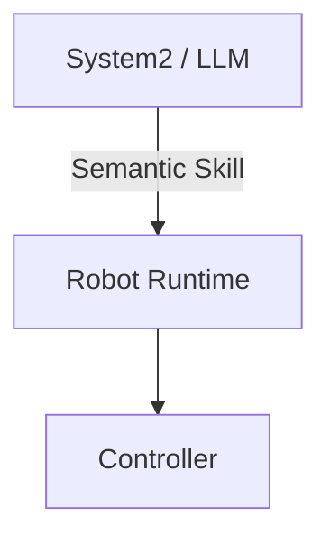

という境界を作ります。

System2には、

```text
PICK
PLACE
NAVIGATE
INSPECT
```

のようなskillを選ばせます。

joint velocityやmotor torqueを直接生成させるわけではありません。

---

### 12. Skill Catalog

LLMがskillを適切に選ぶには、そのskillが何を意味するかを知る必要があります。

そこでSkill Catalogを用意します。

例えば、

```text
PICK

Purpose:
  指定されたobjectを把持する

Parameters:
  target_id

Preconditions:
  gripperが空
  targetが利用可能

Effects:
  targetを保持する
```

のように記述します。

Skill Plannerには、

```text
TaskSpec
WorldState
GroundingResults
Skill Catalog
```

を渡します。

これによりSystem2は、

```text
PICK(obj_0)
PLACE(obj_0, NEXT_TO, obj_2)
```

のようなSkillPlanを生成できます。

---

### 13. SkillPlan

SkillPlanは、

> **何を、どの順番で実行するか**

を表します。

```text
SkillPlan
 ├─ PICK(obj_0)
 └─ PLACE(
      object=obj_0,
      relation=NEXT_TO,
      reference=obj_2
    )
```

Skillごとにparameter schemaを分けることで、

```text
PICK + PickParameters
PLACE + PlaceParameters
```

という対応関係を型として表現します。

LLMが生成するschemaは、可能な限り「不正な組み合わせを表現しにくい」設計にします。

---

### 14. Plan Validation

LLMが生成したSkillPlanは、そのままRobot Runtimeへ送信しません。

間にdeterministicなPlan Validatorを置きます。

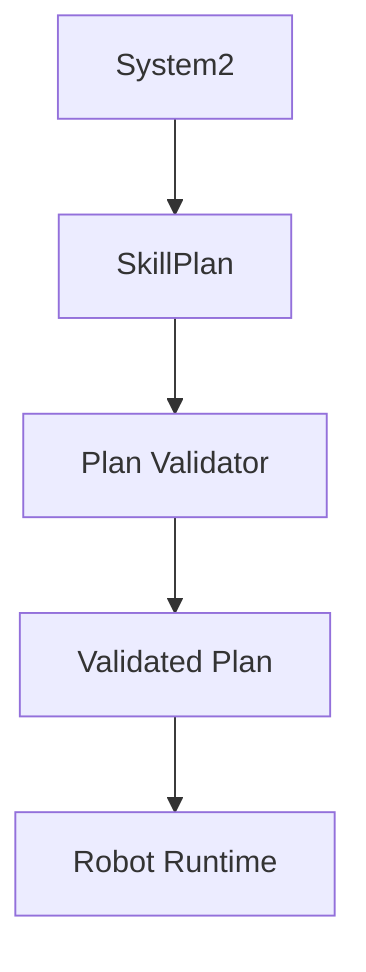

Validatorでは例えば、

#### Reference Integrity

```text
target_idがWorldStateに存在するか
```

#### Skill Preconditions

```text
すでにobjectを持っている状態で
別のPICKをしていないか
```

#### Skill Effects

```text
PICK(obj_0)
 ↓
holding = obj_0

PLACE(obj_0)
 ↓
holding = None
```

などをvirtualに実行します。

これにより、

```text
PLACEだけのplan
```

などを実行前にrejectできます。

---

### 15. ExecutabilityとGoal Satisfaction

Plan Validationでは、2つの概念を区別する必要があります。

```text
Executability
= このplanを実行できるか

Goal Satisfaction
= このplanでユーザーのgoalを達成できるか
```

例えば、

```text
PICK(green)
PLACE(green, NEXT_TO, red)
```

が実行可能でも、

```text
"赤を青の隣に置いて"
```

というgoalは達成しません。

したがってproduction systemでは、

```text
Plan Validator
Goal Validator
```

あるいは同等の仕組みが必要になります。

---

### 16. SkillRequest

SkillPlanはSystem2側のrepresentationです。

Robot Runtimeへ実際に送るときは`SkillRequest`へ変換します。

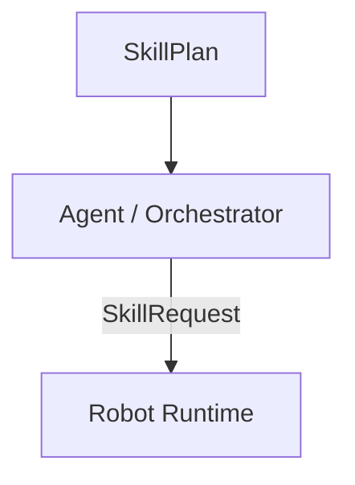

SkillRequestには、

```text
SkillStep
timeout
```

など、**今回の実行に必要な情報**を持たせます。

一方、

```text
PICKの成功条件
PLACEのprecondition
```

などskillそのものの仕様はRobot Runtime側のSkill implementationが持ちます。

これにより、

```text
Plan = WHAT TO EXECUTE

Request = EXECUTION REQUEST

Runtime = HOW TO EXECUTE
```

という責務分離ができます。

---

### 17. Robot Runtime

Robot Runtimeは、1つのSkillRequestを受け取って実行します。

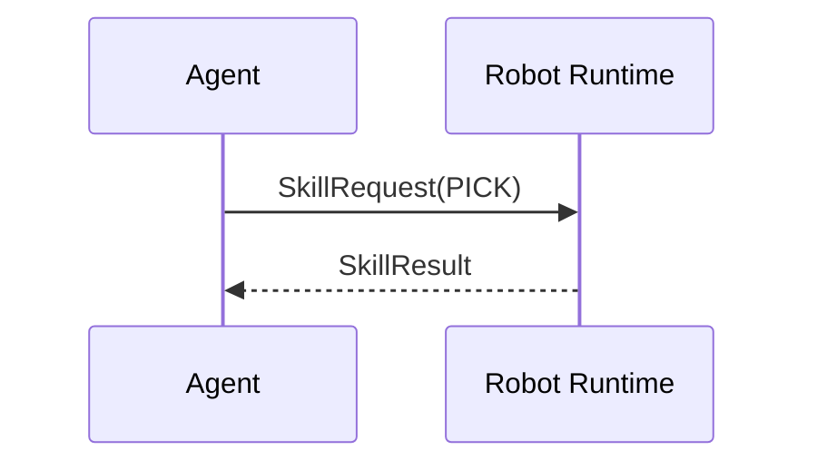

Runtime内部では将来的に、

```text
Motion Planning
VLA / Learned Policy
Controller
Sensor Feedback
Safety Check
```

などを利用できます。

重要なのはSystem2から見ると、これらを、

```text
PICK
PLACE
```

というstableなinterfaceの後ろへ隠せることです。

---

### 18. SkillResult

Robot Runtimeは実行結果をstructuredに返します。

例えば、

```text
SUCCEEDED
FAILED
TIMEOUT
CANCELLED
```

と、

```text
TARGET_UNAVAILABLE
PATH_UNAVAILABLE
ACTION_FAILED
SAFETY_VIOLATION
```

などを組み合わせます。

failure reasonの粒度は、

> **上位層のrecovery strategyが変わる粒度**

にすると扱いやすくなります。

---

### 19. Recovery

Physical AIは、一度Planを作って最後まで実行するだけでは不十分です。

現実世界は変化するため、

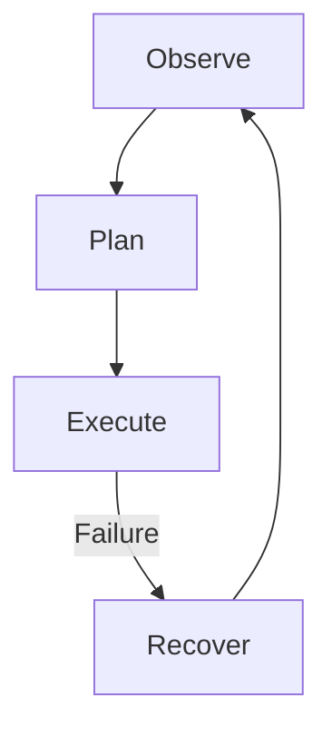

というclosed loopが必要です。

Recovery Routerでは、SkillResultから次のactionをdeterministicに選択します。

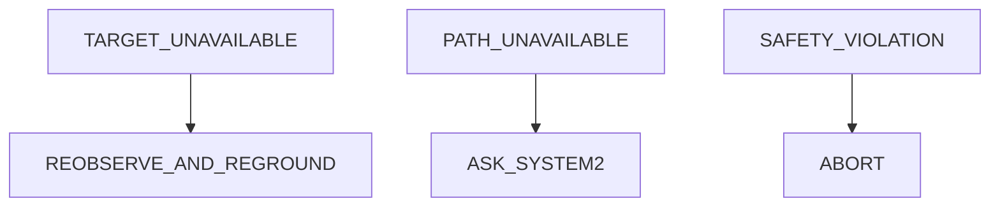

明確なrecovery strategyがあるfailureまでLLMへ渡す必要はありません。

---

### 20. Reobserve and Reground

例えばPICK中に対象が消え、

```text
TARGET_UNAVAILABLE
```

となった場合、古いWorldStateは信用できません。

そこで、

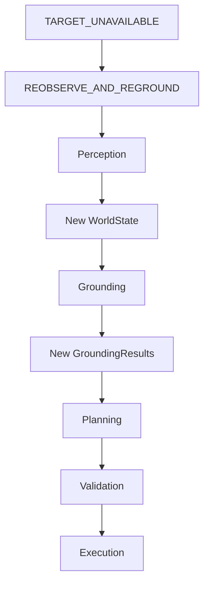

と戻ります。

一方、ユーザーのinstructionを表す`TaskSpec`は変わっていないため、Task Parsingからやり直す必要はありません。

これはデータの依存関係を考えると自然です。

```text
TaskSpec         ← goalなので保持

WorldState       ← 再生成
GroundingResults ← 再生成
SkillPlan        ← 再生成
```

---

### 21. Agent / Orchestrator

ここまでのcomponentをAgentが接続します。

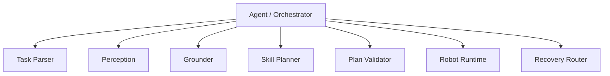

ここで重要なのは、

> **Agent = LLMではない**

ということです。

Agentは通常のsoftware orchestration layerとして、

```text
Observe
Ground
Plan
Validate
Execute
Recover
```

を管理できます。

LLMは必要なreasoningを行うcomponentの1つです。

---

### Day 2補講 — Timing Boundary

#### 22. なぜSystem 2とRobot Runtimeを分離するのか

責務だけでなく、**時間スケール**も大きく異なります。

```text
System2 / LLM
────────────────
数百ms〜数秒
latencyが変動
non-deterministic

        ↓ Skill

Robot Runtime
────────────────
ms〜数十ms
timing requirementあり

        ↓

Controller
────────────────
さらに高速
より強いtiming requirement
```

LLMの推論が遅れたからといって、robot control loopまで停止してはいけません。

---

#### 23. 100 Hz Mini-lab

実行コード：[`day2/rt_mini_lab.py`](../day2/rt_mini_lab.py)。コマンドは[README](../README.md#2-外部apiなしのmini-lab)を参照してください。

10 ms周期のloopを作り、

```text
period
execution time
jitter
deadline miss
```

を測定するmini-labです。

##### Period

実際のloop開始間隔。

##### Execution Time

1 iterationの処理時間。

##### Jitter

予定開始時刻と実際の開始時刻のずれ。

##### Deadline Miss

定めたdeadlineまでに処理が完了しなかったこと。

ここで重要なのは、

> **Periodが10 msを超えたこととDeadline Missは同じではない**

という点です。

開始が少し遅れても、次のdeadlineまでに処理が終了すればdeadline missではありません。

---

#### 24. Absolute Scheduling

周期loopでは、

```python
process()
time.sleep(period)
```

とすると、

```text
execution time + sleep
```

が周期になってしまいます。

そこで、

```text
next scheduled time
        -
current time
        =
sleep time
```

として、最初の基準時刻から各iterationの予定時刻を計算します。

これにより長期的なdriftを抑えられます。

ただし、

> 平均周期が正しいことと、各iterationのtimingが保証されることは別

です。

---

#### 25. CPU LoadとJitter

学習時に通常のLinux上で100 Hz loopを実行した例では、平均周期はおおむね10 msとなりました。

同じ学習セッションでCPU loadを加えた例では、最大jitterはおよそ、

```text
約1.1 ms
    ↓
約3.25 ms
```

まで増加しました。この値は当時の環境で得た参考値であり、現在の`rt_mini_lab.py`はCPU loadの生成までは自動化していません。

平均periodは10 msのままでも、個々のiterationは、

```text
13 ms
7 ms
10 ms
...
```

のように揺れます。

つまり、

> **平均100 Hzで動くことと、100 Hzのtimingが保証されることは違う**

ことが分かります。

---

#### 26. Real-Timeの分類

##### Best-effort

できるだけdeadlineに間に合わせるが保証しない。

通常Linux上の一般的なapplicationは基本的にここです。

##### Soft Real-Time

deadline missによって品質は低下するが、多少のmissは許容されます。

##### Firm Real-Time

deadlineを過ぎた結果には価値がありません。ただし少数のmissが直ちにsystem failureになるとは限りません。

##### Hard Real-Time

deadline missを許容できず、worst-caseを含めたtiming guaranteeが必要です。

重要なのは、

> **100 HzだからHard Real-Timeなのではない**

ことです。

Real-Time requirementはfrequencyではなく、

> **deadlineを外したとき何が起きるか**

によって決まります。

---

#### 27. Day 2 Architecture

Day 2終了時点のarchitectureは次のようになります。

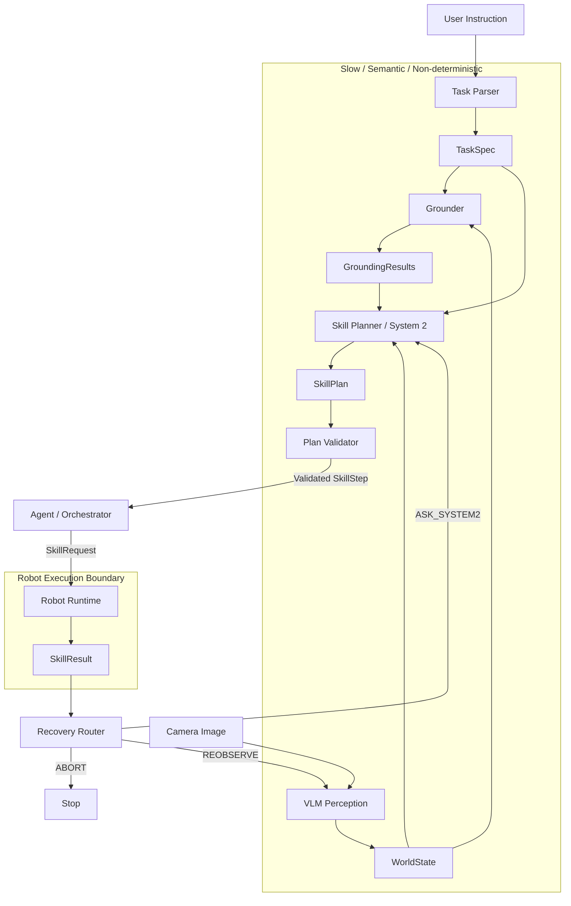

---

#### 28. Day 1–2で身につける設計原則

この2日間で最も重要なのは、個々のAPIの使い方ではありません。

Physical AIシステムを、次の責務へ分解して考えられることです。

```text
Perception
    ↓
World Representation
    ↓
Grounding
    ↓
Reasoning / Planning
    ↓
Deterministic Validation
    ↓
Skill Interface
    ↓
Robot Runtime
    ↓
Control / Safety
```

そして各境界では、

```text
What information crosses this boundary?

Who owns this state?

What can be probabilistic?

What must be deterministic?

What happens when it fails?

What timing requirement exists?
```

を考えます。

LLM/VLMをロボットへ組み込むときに重要なのは、

> **AIにすべてを任せることではなく、AIが得意なsemantic reasoningと、robotics側が得意なgeometry・execution・control・safetyを適切なinterfaceで接続すること**

です。

Day 1–2では、そのための最小のclosed-loop Physical AI architectureを構築しました。

---

#### 29. 次のステップ

ここまでは主に、

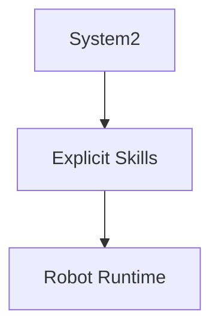

を扱いました。

次はRobot Runtime側へlearned behaviorを導入します。

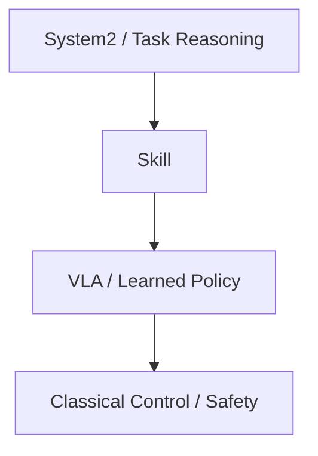

そのために次章では、

- Behavior Cloning
- Imitation Learning
- VLA
- Diffusion / Flow-based Policy
- Physical Prompting

を扱います。

Day 1–2で作ったSkill boundaryを維持したまま、

> **どの部分をlearned policyへ置き換えるとPhysical AIとして何が変わるのか**

を見ていきます。

---

## Day 3 — Robot Learning・VLA・Action Chunking

### 30. この章のゴール

関連コード：[`day3/bc_mini_lab.py`](../day3/bc_mini_lab.py)、[`day3/bc_mini_lab_action_chunking.py`](../day3/bc_mini_lab_action_chunking.py)、[`day3/lerobot_dataset_lab.py`](../day3/lerobot_dataset_lab.py)、[`day3/lerobot_act_lab.py`](../day3/lerobot_act_lab.py)

BCのmini-labはCPUでも実行できます。LeRobotの例は外部datasetを取得し、ACTのtraining stepにはCUDA環境が必要です。実行条件は[README](../README.md#4-lerobot--act)を参照してください。

Day 3では、Day 2までのRobot Runtimeに**learned policy**を導入するための基礎を学びます。

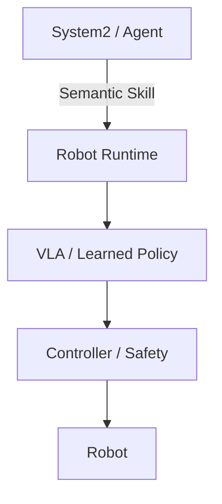

重要なのは、VLAですべてを置き換えることではありません。

Day 2で作ったSkill boundaryを維持しながら、

> **どの部分をlearned policyに任せ、どの部分をclassical roboticsに残すか**

を考えます。

---

### 31. Behavior Cloning

Behavior Cloning（BC）は、expert demonstrationから

```mermaid
flowchart LR
    O[Observation] --> Policy[Policy]
    Policy --> A[Action]
```

の対応をsupervised learningで学習する、最も基本的なImitation Learningです。

2D point robotのmini-labでは、

```mermaid
flowchart LR
    State["robot x,y<br/>goal x,y"] --> MLP[MLP]
    MLP --> Action["velocity x,y"]
```

を学習しました。

PyTorchでのtrainingも通常のsupervised learningと同じです。

```mermaid
flowchart LR
    Dataset[Dataset] --> Policy["Policy<br/>nn.Module"]
    Policy --> Prediction[Prediction]
    Prediction --> Loss[Loss]
    Loss --> Backward["backward()"]
    Backward --> Optimizer[Optimizer]
```

---

### 32. Distribution Shift

BCの重要な問題が**distribution shift**です。

training data上では小さなaction errorでも、closed-loopでは誤差が次の入力状態を変えてしまいます。

```mermaid
flowchart TD
    Error[Action Error]
    Error --> State[少し違うStateへ移動]
    State --> OOD[Demonstrationに少ないState]
    OOD --> LargerError[Prediction Error増大]
    LargerError --> State
```

つまりRobot Policyでは、

> **自分の出力が、次に自分が見る入力を変える**

という特徴があります。

そのため、

> **training / validation lossが小さいことと、robot taskが成功することは同じではない**

ことが重要です。

```mermaid
flowchart LR
    Offline["Offline Evaluation<br/>Loss"] --> Eval[Policy Evaluation]
    Closed["Closed-loop Evaluation<br/>Rollout / Success Rate"] --> Eval
```

DAggerはlearner自身が訪れたstateにもexpert actionを追加することで、このdistribution shiftを軽減する方法の一つです。

---

### 33. BCからVLAへ

toy BCでは、

```mermaid
flowchart LR
    State["Robot State + Goal"] --> MLP[MLP]
    MLP --> Action[Action]
```

でした。

VLA（Vision-Language-Action）では、これをより一般化します。

```mermaid
flowchart TD
    Image[Image] --> Policy[Multimodal Policy]
    Language[Language Instruction] --> Policy
    State["Robot State<br/>Proprioception"] --> Policy
    Policy --> Action[Robot Action]
```

ここで重要なのは、

- **BC** = 学習方法
- **VLA** = model / capability / input-output architecture

という違いです。

したがって両者は対立する概念ではなく、

```mermaid
flowchart LR
    Demo[Expert Demonstrations]
    Demo -->|Behavior Cloning| VLA[VLA Policy]
```

のように、VLAをBCで学習することもできます。

---

### 34. Action Representation

Robot Policyが何をactionとして出力するかは重要な設計判断です。

例えば、

- joint position / delta
- joint velocity
- end-effector pose / delta
- gripper command

などがあります。

VLAがmotor torqueまで直接生成する必要はありません。

```mermaid
flowchart TD
    VLA[VLA]
    VLA --> Target["EE Target / Joint Target"]
    Target --> IK["IK / Trajectory Generation"]
    IK --> Controller[Controller]
    Controller --> Robot[Robot]
```

このようにlearned policyとclassical roboticsを組み合わせることもできます。

---

### 35. Action Chunking

1 stepずつactionを予測する代わりに、未来の複数actionをまとめて生成する方法を**Action Chunking**と呼びます。

```mermaid
flowchart LR
    Obs["Observation t"] --> Policy[Policy]
    Policy --> Chunk["a_t<br/>a_t+1<br/>a_t+2<br/>...<br/>a_t+H"]
```

利点は、

- 時間的にcoherentなmotionを生成しやすい
- Policy inference回数を減らせる

ことです。

一方でchunkを長くすると、

```mermaid
flowchart LR
    Obs["Observation at t"] --> Prediction["Long Action Chunk"]
    Prediction --> Time[Time Passes]
    Time --> Change[Environment Changes]
    Change --> Stale[Stale Actions]
```

という問題があります。

つまり、

> **長いchunkによるcoherence / inference efficiencyと、短いreplanningによるreactivityにはtrade-offがある**

ということです。

---

### 36. Multimodal Action Distribution

単純なMSEによるBehavior Cloningでは、複数の正解行動がある場合に問題が起こります。

例えば障害物を上から避けるtrajectoryと下から避けるtrajectoryの両方がdemonstrationに存在するとします。

```mermaid
flowchart LR
    Obs[Observation] --> ExpertA[上から回避]
    Obs --> ExpertB[下から回避]

    ExpertA --> MSE[MSE Regression]
    ExpertB --> MSE

    MSE --> Mean[平均的なAction]
    Mean --> Collision[障害物方向になる可能性]
```

Robot actionはしばしば**multimodal distribution**になります。

これを扱う方法として、

- Conditional VAE
- Diffusion Policy
- Flow Matching

などがあります。

---

### 37. Diffusion Policy

Diffusion Policyではactionを直接一点回帰するのではなく、

> **observationに条件付けられたaction distribution**

を学習します。

trainingではexpert action chunkへnoiseを加えます。

```mermaid
flowchart LR
    Expert[Expert Action Chunk]
    Expert --> Noise[Add Noise]
    Noise --> Noisy[Noisy Action]
    Obs[Observation] --> Network[Neural Network]
    Noisy --> Network
    Level[Noise Level] --> Network
    Network --> Estimate["Noise / Denoising Direction"]
```

inferenceではnoiseからactionを生成します。

```mermaid
flowchart LR
    Noise[Random Noise]
    Noise --> D1[Denoise]
    D1 --> D2[Denoise]
    D2 --> D3[...]
    D3 --> Action[Action Chunk]
```

これにより、複数の妥当なtrajectoryを持つaction distributionを扱えます。

一方、複数回のnetwork evaluationが必要になるため、inference costとのtrade-offがあります。

---

### 38. Flow Matching

Flow Matchingもnoise distributionからaction distributionを生成するgenerative policyとして利用できます。

```mermaid
flowchart TD
    Current["Current Noisy Action"]
    Obs[Observation]
    Time["Time t"]

    Current --> NN[Neural Network]
    Obs --> NN
    Time --> NN

    NN --> Vector["Velocity in Action Space"]
    Vector --> Integration[ODE Integration]
    Integration --> Action[Action]
```

Neural Networkは、

> **現在のaction-space上の状態を、data distributionへどの方向に動かすか**

を表すvector fieldを学習します。

DiffusionとFlow Matchingはどちらもmultimodalなaction generationを扱えますが、生成過程やtraining objectiveが異なります。

---

### 39. TransformerとDiffusion / Flow

TransformerとDiffusion / Flowは競合する概念ではありません。

```mermaid
flowchart TD
    Inputs["Image + Language + Proprioception"]
    Inputs --> Transformer["Transformer<br/>情報処理・Multimodal Fusion"]
    Transformer --> Generator["Action Generation<br/>Regression / Diffusion / Flow"]
    Generator --> Chunk[Action Chunk]
```

つまり、

- **Transformer** = 情報を処理・融合するNeural Network architecture
- **Diffusion / Flow** = action distributionを生成するframework

という別軸の技術です。

そのため、Transformerを内部networkとして使うFlow / Diffusion Policyも構成できます。

---

### 40. Physical Prompting / In-Context Robot Learning

通常のBehavior Cloningやfine-tuningでは、demonstrationをtraining dataとしてweight updateします。

```mermaid
flowchart LR
    Demo[Demonstration]
    Demo --> Training[Training]
    Training --> Update[Weight Update]
    Update --> Policy[Adapted Policy]
```

Physical Prompting / In-Context Robot Learningでは、

```mermaid
flowchart TD
    Pretrained[Pretrained Policy] --> Inference[Inference]
    Demo["Demonstration / Physical Context"] --> Inference
    Inference --> Behavior[Adapted Behavior]
```

のように、**weight updateなしでその場のdemonstration/contextを利用する**ことを目指します。

これは家庭など、

- 家ごとに環境が違う
- objectが違う
- 配置が違う
- ユーザー固有のtaskがある

といったlong-tailな環境で特に重要になります。

ただし、

```mermaid
flowchart LR
    Demo[Physical Prompt]
    Demo --> First["Time-to-first-success"]
    Demo --> Reliable["Time-to-reliable-success"]
```

は別の評価軸です。

一度成功できることと、安定して成功できることは同じではありません。

---

### 41. LeRobot Dataset

この教材ではLeRobotを使ってRobot Learning datasetの構造を確認します。

PushT datasetには、

- `observation.image`
- `observation.state`
- `action`
- `episode_index`
- `frame_index`
- `timestamp`

などがあります。

Robot Learning datasetは単なるIID sample集ではなく、trajectoryとして構造化されています。

```mermaid
flowchart TD
    Episode[Episode]
    Episode --> F0[Frame 0]
    Episode --> F1[Frame 1]
    Episode --> F2[Frame 2]
    Episode --> FN[...]

    F0 --> O0[Observation]
    F0 --> A0[Action]
```

`delta_timestamps`を使うことで、元のsingle-step action sequenceからtraining時にaction chunkを取得できます。

```mermaid
flowchart LR
    Dataset["Raw Trajectory<br/>a0,a1,a2,a3,..."]
    Dataset --> Sampling["delta_timestamps"]
    Sampling --> Chunk["a_t,a_t+1,...,a_t+H"]
```

raw datasetをaction chunkごとに重複保存する必要はありません。

---

### 42. ACT — Action Chunking with Transformers

続いてLeRobotのACT Policyを確認します。

```mermaid
flowchart TD
    Image["observation.image"] --> Vision[ResNet18]
    State["observation.state<br/>Proprioception"] --> StateProj[State Projection]

    Vision --> Transformer[Transformer]
    StateProj --> Transformer

    Queries[Action Queries] --> Transformer

    Transformer --> Head[Action Head]
    Head --> Chunk["Action Chunk<br/>H × Action Dim"]
```

リポジトリのlabで設定している、

```text
chunk_size = 100
action_dim = 2
```

なので、

```text
action.shape = [100, 2]
```

となりました。

ACTは時間方向をflattenせず、

```text
[time, action_dim]
```

として明示的に保持します。

---

### 43. ACTとCVAE

ACTではtraining時にCVAEも利用します。

```mermaid
flowchart TD
    Expert["Expert Action Chunk"] --> VAE[VAE Encoder]
    State["Robot State"] --> VAE

    VAE --> Latent["Latent z"]

    Image[Image] --> Vision[Vision Encoder]
    Vision --> Main[ACT Transformer]
    State --> Main
    Latent --> Main

    Main --> Chunk[Predicted Action Chunk]
```

latent variableによってdemonstration中のvariationを表現できます。

ACTは単純なMSE BCより豊かなaction sequenceを扱えますが、Diffusion Policyとは異なるgenerative mechanismです。

---

### 44. Toy BCからLeRobot ACTまで

最初に自作したtoy BCとLeRobotのACTは、規模こそ大きく異なりますが、trainingの基本構造は同じです。

```mermaid
flowchart LR
    Dataset[LeRobotDataset]
    Dataset --> Temporal[Temporal Sampling]
    Temporal --> Loader[DataLoader]
    Loader --> ACT[ACTPolicy]
    ACT --> Loss[Loss]
    Loss --> Backward["backward()"]
    Backward --> Optimizer[Optimizer]
```

Policy内部が、

```mermaid
flowchart LR
    Toy["Toy BC"] --> MLP[MLP]

    Real["ACT"] --> Vision[Vision Encoder]
    Real --> Transformer[Transformer]
    Real --> CVAE[CVAE]
    Real --> Chunk[Action Chunk Decoder]
```

へ高度化しているだけで、根底には同じPyTorchのtraining loopがあります。

> **Dataset → Tensor → nn.Module → Loss → Backpropagation**

---

### 45. Day 3で覚えておくこと

1. Behavior Cloningはexpert demonstrationからobservation→actionを学習する
2. Robot Policyではclosed-loop distribution shiftが重要
3. offline lossだけでなくrollout / task successで評価する
4. BCは学習方法、VLAはmodel / capabilityであり両立する
5. Proprioceptionは画像とは別の重要なrobot state input
6. Action Chunkingは複数stepのactionをまとめて予測する
7. chunk lengthにはefficiency / coherenceとreactivityのtrade-offがある
8. Robot actionはmultimodalになり得る
9. Diffusion / Flowはaction distributionを生成する方法
10. TransformerはDiffusion / Flowとは別軸のarchitecture
11. Physical Promptingはweight updateなしで現場のcontextを利用する方向性
12. LeRobotはDataset・temporal sampling・Policyを共通interfaceで扱える
13. ACTはVision + Proprioception + Transformer + CVAE + Action Chunkingを組み合わせる
14. Learned PolicyはRobot Runtime / Safety / Controllerと組み合わせて使う

---

### 46. Day 3終了時点のArchitecture

Day 1〜3を統合すると、現在のPhysical AI architectureは次のようになります。

```mermaid
flowchart TD
    User[User Instruction]

    subgraph Slow["Slow / Semantic / System 2"]
        Parser[Task Parser]
        Perception[VLM Perception]
        Grounder[Grounder]
        Planner["Skill Planner / System2"]
        Validator[Plan Validator]
    end

    subgraph Runtime["Robot Runtime"]
        Router[Skill Router]
        Classical["Classical Skill<br/>Planning / IK"]
        Learned["Learned Skill<br/>VLA / ACT"]
    end

    subgraph Fast["Fast / Robot Execution"]
        Safety[Safety Layer]
        Controller[Controller]
        Robot[Robot]
    end

    User --> Parser
    Parser --> Planner

    Perception --> Grounder
    Grounder --> Planner

    Planner --> Validator
    Validator -->|Semantic Skill| Router

    Router --> Classical
    Router --> Learned

    Classical --> Safety
    Learned -->|Action Chunk| Safety

    Safety --> Controller
    Controller --> Robot

    Robot -->|Sensor Observation| Perception
```

Day 3ではDay 2のSkill boundaryの下へlearned policyを導入しました。

最終的なポイントは、

> **「LLM → VLA → Robot」という一本の巨大AIにするのではなく、semantic reasoning・learned skill・classical robotics・control / safetyを異なる責務と時間スケールで組み合わせる**

ことです。

これで、

```mermaid
flowchart LR
    D1["Day 1<br/>Perception / Grounding"]
    D2["Day 2<br/>System2 / Skill / Runtime"]
    D3["Day 3<br/>Robot Learning / VLA"]

    D1 --> D2 --> D3
```

まで接続できました。

---

## Day 4 — Hybrid Physical AI・System 1 Recovery

### 47. この章のゴール

関連コード：[`skill_router.py`](../physical_ai/skill_router.py)、[`system1_recovery.py`](../physical_ai/system1_recovery.py)、[`recovery.py`](../physical_ai/recovery.py)、[`day4/jev_recovery_benchmark.py`](../day4/jev_recovery_benchmark.py)

Day 4では、Day 1〜3で作ったcomponentを1つのPhysical AI systemとして統合します。

Day 3終了時点では、

```mermaid
flowchart TD
    System2["System2 / Skill Planner"]
    Runtime["Robot Runtime"]
    Classical["Classical Skill"]
    Learned["Learned Skill / VLA"]
    Control["Controller / Safety"]
    Robot["Robot"]

    System2 --> Runtime
    Runtime --> Classical
    Runtime --> Learned
    Classical --> Control
    Learned --> Control
    Control --> Robot
```

という構成まで到達しました。

Day 4ではここへ、

- Skill Router
- System1 Decision
- Recovery Context
- deterministic recovery policy
- Failure Injection

を追加します。

Request-level safetyはDay 5で扱います。また、`SkillRouter`はroutingの境界を示す最小実装であり、現在の`Agent`の実行経路にはまだ接続されていません。

重要なテーマは、

> **AIにすべてを判断させるのではなく、System2・System1・deterministic logic・Safetyの責務を分離する**

ことです。

---

### 48. Skill Router

Robot Runtimeの内部では、同じsemantic skillでも複数の実装方法を利用できます。

例えば、

```text
PICK
PLACE
NAVIGATE
```

というSkillに対して、

```text
Classical Planning
VLA / Learned Policy
```

のどちらを使うか選択できます。

そこで`SkillRouter`を用意します。

```mermaid
flowchart LR
    Step["SkillStep"] --> Router["Skill Router"]

    Router --> Classical["Classical Backend"]
    Router --> Learned["Learned Backend"]
```

今回の最小実装では、

```python
class ExecutionBackend(str, Enum):
    CLASSICAL = "classical"
    LEARNED = "learned"


class SkillRouter:
    def route(self, step: SkillStep) -> ExecutionBackend:
        match step.skill:
            case SkillType.PICK | SkillType.PLACE:
                return ExecutionBackend.LEARNED
            case _:
                raise ValueError(f"Unsupported skill: {step.skill}")
```

のようなstatic routingとしました。

ここで重要なのは、

```text
System2
= WHAT should be done?

Skill Router
= WHICH implementation should execute it?
```

という責務の違いです。

---

### 49. System 1をどこへ置くか

System1 modelを導入するとき、最初に問題になるのが、

> **System1は何を判断するcomponentなのか**

という点です。

Skill RouterへそのままSystem1を入れて、

```text
PICK → Classical / Learned
```

を選ばせることもできます。

このlabでは、限定された候補から素早く選ぶ用途として、

> **Skill executionが失敗したときのbounded recovery decision**

に利用しました。

```mermaid
flowchart TD
    Runtime["Robot Runtime"] --> Result["SkillResult"]

    Result --> Router["Recovery Router"]

    Router -->|"明確なFailure"| Deterministic["Deterministic Recovery"]

    Router -->|"ACTION_FAILED"| System1["System1 / Jev"]

    System1 --> Retry["RETRY"]
    System1 --> Reposition["REPOSITION"]
    System1 --> Reobserve["REOBSERVE_AND_REGROUND"]
    System1 --> S2["ASK_SYSTEM2"]
```

この構成では、

```text
System2
= long-horizon / open-ended reasoning

System1
= bounded / fast situational decision

Robot Skill
= physical execution

Controller
= high-frequency tracking / stabilization
```

という役割分担になります。

---

### 50. RecoveryActionの拡張

Day 2ではRecoveryActionとして、

```text
REOBSERVE_AND_REGROUND
ASK_SYSTEM2
ABORT
```

を利用していました。

Day 4ではSystem1 Recoveryを導入するため、

```python
class RecoveryAction(str, Enum):
    RETRY = "retry"
    REPOSITION = "reposition"
    REOBSERVE_AND_REGROUND = "reobserve_and_reground"
    ASK_SYSTEM1 = "ask_system1"
    ASK_SYSTEM2 = "ask_system2"
    ABORT = "abort"
```

へ拡張しました。

Recovery Routerは依然としてdeterministicです。

```mermaid
flowchart TD
    Result["SkillResult"] --> Router["Recovery Router"]

    Router -->|"TARGET_UNAVAILABLE"| Reobserve["REOBSERVE_AND_REGROUND"]
    Router -->|"SAFETY_VIOLATION"| Abort["ABORT"]
    Router -->|"ACTION_FAILED"| Ask1["ASK_SYSTEM1"]
    Router -->|"その他"| Ask2["ASK_SYSTEM2"]
```

ここで重要なのは、

> **Recovery Router自身はJevなどのAI modelを知らない**

ことです。

`ASK_SYSTEM1`は、

```text
System1に判断を委譲する
```

というrouting resultにすぎません。

これによりSystem1 implementationを別のmodelへ交換しても、Recovery Routerは変更する必要がありません。

---

### 51. RecoveryContext

System1へ単純に`SkillResult`だけ渡しても、適切なRecovery判断はできません。

例えば、

```text
FAILED
ACTION_FAILED
```

だけでは、

- graspが滑った
- targetが動いた
- robotが届かない
- contactできなかった

などを区別できません。

そこで、

```python
class ExecutionObservation(BaseModel):
    target_visible: bool
    target_position_changed: bool
    target_reachable: bool
    contact_detected: bool
    grasp_quality: float = Field(ge=0.0, le=1.0)


class RecoveryContext(BaseModel):
    world_state: WorldState
    skill_result: SkillResult
    retry_count: int
    observation: ExecutionObservation
```

というcontextを導入しました。

```mermaid
flowchart TD
    World["WorldState"] --> Context["RecoveryContext"]
    Result["SkillResult"] --> Context
    Observation["ExecutionObservation"] --> Context
    History["retry_count"] --> Context

    Context --> System1["System1 Recovery"]
    System1 --> Action["RecoveryAction"]
```

ここで得られた重要な設計上の学びは、

> **AI modelが賢くても、decisionに必要なstateがinterfaceを越えて届いていなければ判断できない**

ということです。

---

### 52. AIに全部渡すとは何か

Recovery Contextを設計するとき、

```text
必要なfeatureだけ人間が選ぶ
```

方法と、

```text
WorldStateを広めに渡してAIに判断させる
```

方法があります。

後者には、

- 人間が重要featureを見落としにくい
- 状況の組み合わせをAIが利用できる
- rule explosionを避けられる

という利点があります。

しかし、

```text
Camera raw image
Point Cloud
全TF
全ROS log
全Sensor History
```

まで無制限に渡すのは、

- latency
- context size
- irrelevant information
- decision instability

の問題があります。

今回の方針は、

```mermaid
flowchart TD
    Raw["Raw Sensors"] --> Perception["Perception / State Estimation"]
    Perception --> World["Structured WorldState"]

    World --> Recovery["RecoveryContext"]
    Recovery --> System1["System1"]
```

としました。

つまり、

> **Raw sensorをそのままAIへ投げるのではなく、robotics側でstructured stateを作り、その中のどの情報がdecisionに効くかをSystem1へ委ねる**

という設計です。

---

### 53. JevをSystem 1 Recoveryとして利用

このlabでは、System 1 Recovery componentの一例として外部サービスのJevを利用します。

実行にはTypeSafe AIから発行されたcredentialが必要で、`RecoveryContext`に含まれる情報が外部APIへ送信されます。利用前にproviderの最新の利用条件とデータ取扱方針を確認してください。設定方法は[README](../README.md#5-jevによるsystem-1-recovery)を参照してください。

interfaceは単純に、

```text
Input:
    RecoveryContext

Output:
    RecoveryAction
```

としました。

```mermaid
flowchart LR
    Context["RecoveryContext"] --> S1["System1Recovery / Jev"]
    S1 --> Action["RecoveryAction"]
```

内部ではRecoveryContextをmodelが判断しやすいcontextへ変換し、

```text
RETRY
REPOSITION
REOBSERVE_AND_REGROUND
ASK_SYSTEM2
```

から1つを選択させました。

重要なのは、

> **Jev固有のAPIをAgentのinterfaceへ露出させない**

ことです。

Agentから見ると、

```python
recovery_action = system1_recovery.decide(context)
```

だけです。

---

### 54. Jev Recovery Mini-benchmark

System1 Recoveryのbehaviorを確認するため、4つのscenarioを用意しました。

以下は学習時の単一runを記録したbehavior probeです。model version、network、実行時期、入力によって結果は変わるため、再実行時に同じ判断やlatencyになることを保証しません。

#### Case 1 — 一時的なgrasp失敗

```text
target_visible         = true
target_position_changed = false
target_reachable       = true
contact_detected       = true
grasp_quality          = 0.8
retry_count            = 0
```

期待：

```text
RETRY
```

結果：

```text
RETRY
```

#### Case 2 — 対象が動いた

```text
target_visible         = true
target_position_changed = true
target_reachable       = true
contact_detected       = false
grasp_quality          = 0.2
```

期待：

```text
REOBSERVE_AND_REGROUND
```

結果：

```text
REOBSERVE_AND_REGROUND
```

#### Case 3 — 現在姿勢では届かない

```text
target_visible         = true
target_position_changed = false
target_reachable       = false
contact_detected       = false
grasp_quality          = 0.0
```

期待：

```text
REPOSITION
```

結果：

```text
REPOSITION
```

#### Case 4 — 何度も失敗している

```text
target_visible         = true
target_reachable       = true
contact_detected       = true
grasp_quality          = 0.3
retry_count            = 3
```

期待：

```text
ASK_SYSTEM2
```

結果：

```text
REPOSITION
```

#### 結果

```text
matched = 3 / 4
```

これは4ケースだけのbehavior probeなので、

```text
accuracy = 75%
```

という一般的な性能評価として解釈してはいけません。

重要なのは、

> **現在のphysical stateに応じたRecovery Actionは適切に変化した一方、retry回数によるescalation policyは自動的には実現されなかった**

ことです。

---

### 55. System 1とDeterministic Policyの境界

retry_count=3でもSystem1は`REPOSITION`を選択しました。

これは必ずしも誤ったphysical判断ではありません。

現在の状態だけを見ると、

```text
まだtargetは見える
reachable
contactも存在
```

ので、

```text
姿勢を変えて再試行
```

という判断には合理性があります。

しかしsystemとして、

```text
3回失敗したらSystem2へescalateする
```

というpolicyを保証したい場合、それはAIへ暗黙に期待すべきではありません。

そこで、

```mermaid
flowchart TD
    Failure["ACTION_FAILED"] --> Limit{"retry_count >= limit?"}

    Limit -->|Yes| S2["ASK_SYSTEM2"]
    Limit -->|No| S1["System1 / Jev"]

    S1 --> Retry["RETRY"]
    S1 --> Reposition["REPOSITION"]
    S1 --> Reobserve["REOBSERVE"]
```

という構成にします。

つまり、

> **状況依存の判断はSystem1**
>
> **retry limit・timeout・安全制約など必ず守るpolicyはdeterministic logic**

とします。

---

### 56. System 1のLatency

最初のbenchmarkでは最初のrequestが約700 msかかりました。

connection / model session startupの影響を除くためwarm-upを追加すると、

```text
317.9 ms
202.0 ms
202.4 ms
292.3 ms
```

となり、

```text
mean latency ≒ 253.6 ms
```

でした。

この小規模な単一runでは、

> **warm-up後はおよそ200〜300 ms級**

のdecision latencyでした。

ここでDay 2の100 Hz mini-labと比較すると、

```mermaid
flowchart TD
    S2["System2 / LLM<br/>slow"]
    S1["System1 / Jev<br/>~200–300 ms"]
    Skill["Skill Execution"]
    Controller["Controller<br/>ms〜10 ms級"]

    S2 --> S1
    S1 --> Skill
    Skill --> Controller
```

となります。

重要なのは、

> **System1がSystem2よりfastであることと、robot controlとしてreal-timeであることは別**

ということです。

200〜300 msは、

```text
high-frequency control loop
```

へ入れるには遅い一方、

```text
PICK失敗後のRecovery Decision
```

には十分利用可能なtime scaleです。

---

### 57. RobotRuntimeのOutcome

Day 2ではRobot Runtimeは、

```text
SkillRequest
    ↓
RobotRuntime
    ↓
SkillResult
```

だけを返していました。

Recovery Contextを作るには、実行中の観測も必要になります。

そこで、

```python
class SkillExecutionOutcome(BaseModel):
    result: SkillResult
    observation: ExecutionObservation | None = None
```

を導入しました。

```mermaid
flowchart LR
    Request["SkillRequest"] --> Runtime["RobotRuntime"]
    Runtime --> Outcome["SkillExecutionOutcome"]

    Outcome --> Result["SkillResult"]
    Outcome --> Observation["ExecutionObservation"]
```

これによりAgentは、

```text
何が失敗したか
+
そのとき何が観測されていたか
```

をSystem1へ渡せます。

---

### 58. Failure Injection付きFake RobotRuntime

今回のRobot RuntimeはまだFake implementationです。

しかし単に常に成功させるのではなく、

```text
PICK 1回目
    ↓
ACTION_FAILED

PICK 2回目
    ↓
SUCCEEDED
```

というfailure injectionを行いました。

```mermaid
flowchart TD
    Pick["PICK"] --> Attempt{"attempt"}

    Attempt -->|"1回目"| Fail["ACTION_FAILED + Observation"]
    Attempt -->|"2回目"| Success["SUCCEEDED"]
```

これにより、Robotが存在しなくても、

```text
Failure
→ Recovery
→ System1
→ Retry
→ Success
```

というclosed-loop orchestrationを検証できます。

Fake Runtimeは捨てコードではありません。

将来的に、

```text
FakeRobotRuntime
GazeboRobotRuntime
RealRobotRuntime
```

へ差し替えるためのsoftware boundaryになります。

---

### 59. AgentへのSystem 1 Recovery統合

Day 2で作ったAgentへSystem1 Recoveryを統合しました。

最終的なfailure pathは、

```mermaid
flowchart TD
    Runtime["Robot Runtime"] --> Result["SkillResult"]

    Result --> Router["Recovery Router"]

    Router -->|"REOBSERVE"| Replan["Perception → Grounding → Planning"]
    Router -->|"ABORT"| Stop["Stop"]

    Router -->|"ASK_SYSTEM1"| Limit{"Retry Limit"}

    Limit -->|"Exceeded"| S2["System2"]
    Limit -->|"OK"| S1["System1 Recovery"]

    S1 -->|"RETRY"| Same["Same SkillRequest"]
    S1 -->|"REPOSITION"| Reposition["Reposition"]
    S1 -->|"REOBSERVE"| Replan
    S1 -->|"ASK_SYSTEM2"| S2
```

となります。

#### RETRY

同じ`SkillRequest`をその場でもう一度実行します。

#### REOBSERVE_AND_REGROUND

古いWorldStateを捨て、

```text
Perception
→ Grounding
→ Planning
→ Validation
```

からやり直します。

#### REPOSITION

本来はreposition skillを実行してから元のskillを再試行します。

今回の圧縮labではactionとして分離したのみで、実際のreposition skillは未実装です。

---

### 60. Pick & Place DemoのEnd-to-End Recovery

教材内のcomponentを接続し、

```text
一番左の赤い箱を青い箱の隣へ置く
```

というtaskを実行するdemoを構成しました。ここでいうEnd-to-Endは、教材内のperceptionからrecoveryまでを指します。物理的なPICK/PLACEは`FakeRobotRuntime`によるsimulationであり、実機動作ではありません。

生成されたSkillPlanは、

```text
PICK(red)
PLACE(red, NEXT_TO, blue)
```

でした。

1回目のPICKで意図的にfailureを発生させました。

```text
PICK
↓
ACTION_FAILED
↓
Recovery Router
↓
ASK_SYSTEM1
↓
Jev
↓
RETRY
```

再実行ではPICKが成功し、その後PLACEまで完了しました。

```mermaid
flowchart TD
    Plan["PICK → PLACE"] --> Pick1["PICK attempt 1"]

    Pick1 -->|"ACTION_FAILED"| RR["Recovery Router"]
    RR -->|"ASK_SYSTEM1"| S1["System1 / Jev"]

    S1 -->|"RETRY"| Pick2["PICK attempt 2"]

    Pick2 -->|"SUCCEEDED"| Place["PLACE"]
    Place -->|"SUCCEEDED"| Done["Task Succeeded"]
```

これにより、

> **Day 1のPerception / GroundingからDay 4のSystem1 Recoveryまでを1つのclosed loopとして接続**

できました。

---

## Day 5 — Safety・Failure Injection・Evaluation

関連コード：[`safety_supervisor.py`](../physical_ai/safety_supervisor.py)、[`agent.py`](../physical_ai/agent.py)、[`robot_runtime.py`](../physical_ai/robot_runtime.py)

この章の`SafetySupervisor`はrequest-level validationを説明するためのprototypeです。対象物の存在確認だけでロボットの安全を保証するものではなく、実機に必要なruntime/control safetyの代替にはなりません。

### 61. Request-level Safety Gate（`SafetySupervisor`）

AIが生成したSkillRequestをRobot Runtimeへ直接流すのではなく、

```text
Agent
→ Safety Supervisor
→ Robot Runtime
```

というrequest-level safety gateを導入しました。

```mermaid
flowchart LR
    Agent["Agent"] --> Safety["Safety Supervisor"]

    Safety -->|"allow"| Runtime["Robot Runtime"]
    Safety -->|"reject"| Violation["SAFETY_VIOLATION"]
```

このprototypeは最小構成として、

```text
PICK targetがWorldStateに存在するか
```

を確認します。

```python
class SafetyDecision(BaseModel):
    allowed: bool
    reason: str | None = None
```

Safety Supervisor自身はRobot Runtimeを呼びません。

```text
check()
→ SafetyDecision
```

だけを返します。

execution flowを管理するのはAgentです。

---

### 62. RobotRuntimeとRobotの違い

RobotRuntimeはRobotそのものではありません。

```mermaid
flowchart LR
    Agent["Agent"]
    Safety["Safety Supervisor"]
    Runtime["RobotRuntime"]
    ROS["ROS2 / Driver / Skill Implementation"]
    Robot["Gazebo / Real Robot"]

    Agent --> Safety
    Safety --> Runtime
    Runtime --> ROS
    ROS --> Robot
```

RobotRuntimeは、

> **上位Physical AIからrobot execution systemを隠蔽するsoftware boundary**

です。

将来的には、

```text
Fake Runtime
    ↓
ROS2 / Gazebo Runtime
    ↓
Real Robot Runtime
```

へ置き換えることができます。

Agentはその違いを知る必要がありません。

---

### 63. Request SafetyとRuntime Safety

Safetyには複数のlayerがあります。

#### Request-level Safety

```text
このSkillRequestを実行してよいか？
```

例えば、

- targetが存在するか
- forbidden zoneでないか
- taskとして許可されているか

などです。

```mermaid
flowchart LR
    Agent --> RequestSafety["Request Safety"]
    RequestSafety --> Runtime["RobotRuntime"]
```

#### Runtime / Control Safety

実機ではさらに、

- speed limit
- force limit
- human distance
- emergency stop
- joint limit

などをexecution layerで監視します。

```mermaid
flowchart LR
    Runtime["Robot Runtime"] --> Controller
    Controller --> RuntimeSafety["Runtime Safety"]
    RuntimeSafety --> Robot
```

このlabではRequest-levelの最小検査のみを実装しました。速度、力、接触、人との距離、非常停止を含むruntime/control safetyは未実装です。

---

### 64. Safety Failureを共通Failure Pathへ統合

Safety reject時にAgentを直接終了するのではなく、

```text
SafetyDecision(false)
    ↓
SkillResult(
    FAILED,
    SAFETY_VIOLATION
)
```

へ変換します。

その後は通常のfailure pathへ流します。

```mermaid
flowchart TD
    Safety["Safety Supervisor"] -->|"reject"| Violation["SAFETY_VIOLATION"]

    Runtime["Robot Runtime"] --> Result["SkillResult"]

    Violation --> Recovery["Recovery Router"]
    Result --> Recovery

    Recovery -->|"SAFETY_VIOLATION"| Abort["ABORT"]
```

この設計により、

```text
Safety由来のFailure
Robot Runtime由来のFailure
```

をAgent内で統一的に扱えます。

---

### 65. Safety Failure Injection

`SafetySupervisor`を意図的に、

```text
allowed = false
```

とするfailure injectionを行いました。

結果は、

```text
[Agent] Failed to execute plan
[Agent] Recovery action: abort
[Agent] Aborted
Result = False
```

となりました。

つまり、

```mermaid
flowchart LR
    Safety["Safety reject"]
    Safety --> Violation["SAFETY_VIOLATION"]
    Violation --> Router["Recovery Router"]
    Router --> Abort["ABORT"]
```

というsoftware上のfailure pathを一通り確認できました。

ここで重要なのは、

> **Safety violation時にはSystem1にもSystem2にも判断を求めない**

ことです。

```text
Safety violation
→ deterministic rule
→ ABORT
```

とします。

---

### 66. AIに任せるもの・任せないもの

今回のlabを通して、AIとdeterministic logicの責務境界が明確になりました。

```mermaid
flowchart TD
    Situation["Situation / Failure"]

    Situation --> Deterministic["Deterministic Logic"]
    Situation --> System1["System1"]
    Situation --> System2["System2"]

    Deterministic --> Hard["Safety / Limits / Retry Policy"]
    System1 --> Bounded["Bounded Situational Decision"]
    System2 --> Open["Open-ended Reasoning / Replanning"]
```

#### Deterministic

必ず守りたいもの。

```text
Safety
Retry Limit
Timeout
Schema / Reference Integrity
Hard Constraints
```

#### System 1

boundedだがrule化すると複雑な状況判断。

```text
RETRY?
REPOSITION?
REOBSERVE?
```

#### System 2

open-ended reasoning。

```text
別のSkill sequenceを作る
Goalを再解釈する
Recovery planを再構築する
```

この分離がHybrid Physical AI architectureの中心になります。

---

### 67. Evaluation

今回の評価は大規模benchmarkではなく、

> **設計したfailure pathが期待通り動くか**

を確認するbehavior-oriented evaluationとしました。

| Metric / Check | Result |
|---|---|
| Normal task execution | PICK → PLACE → Succeeded |
| Recovery success | PICK failure → System1 → RETRY → Succeeded |
| Safety stop | SAFETY_VIOLATION → ABORT |
| System1 behavior probe | 4ケース中3ケースで期待したAction |
| System1 latency | warm-up後 約200〜300 ms |
| Mean System1 latency | 約254 ms |
| Retry limit | deterministic policyで管理 |
| System2 escalation | System1だけでは保証されない |
| REPOSITION | Action定義のみ、実Skill未実装 |

ここで、

```text
3 / 4
```

という結果を一般的なaccuracyとして扱ってはいけません。

4ケースはmodel性能benchmarkではなく、

> **architecture上期待するbehaviorを確認するprobe**

です。

---

### 68. Sim2Realで問題になるもの

Fake Runtimeでは状態を正確に作れます。

しかし実機では、

```text
target_visible
target_position_changed
target_reachable
contact_detected
grasp_quality
```

のすべてにnoiseや推定誤差があります。

```mermaid
flowchart TD
    Sim["Simulation / Fake State"]
    Real["Real Robot"]

    Sim --> Exact["Clean State"]
    Real --> Noise["Sensor Noise"]
    Real --> Delay["Latency"]
    Real --> Dynamics["Dynamics Error"]
    Real --> Contact["Contact Uncertainty"]

    Noise --> Estimated["Estimated WorldState"]
    Delay --> Estimated
    Dynamics --> Estimated
    Contact --> Estimated
```

主なReality Gapには、

- perception error
- camera / depth noise
- object identity error
- dynamics mismatch
- friction
- contact uncertainty
- sensor latency
- communication latency
- actuator error

などがあります。

実機では単純なbooleanより、

```text
confidence
history
uncertainty
hysteresis
```

なども重要になります。

---

### 69. Day 1〜5 Final Architecture

Day 1〜5を統合すると、今回構築したPhysical AI architectureは次のようになります。

以下は実装の方向性を含む全体像です。現在のリポジトリでは、ROS 2、Gazebo、実機、実際のclassical/learned skill backend、runtime/control safetyは未実装です。実装状況の一覧は[README](../README.md#実装範囲)を参照してください。

```mermaid
flowchart TD
    User["Natural Language Task"]

    User --> Parser["Task Parser"]

    Sensors["Camera / Sensors"] --> Perception["Perception / VLM"]
    Perception --> World["WorldState"]

    Parser --> Grounder["Grounder"]
    World --> Grounder

    Grounder --> System2["System2 / Skill Planner"]
    Parser --> System2

    System2 --> Plan["SkillPlan"]
    Plan --> Validator["Plan Validator"]

    Validator --> Agent["Agent / Orchestrator"]

    Agent --> Safety["Request-level Safety Supervisor"]

    Safety -->|"allow"| Runtime["RobotRuntime"]
    Safety -->|"reject"| SafetyViolation["SAFETY_VIOLATION"]

    Runtime --> SkillRouter["Skill Router"]

    SkillRouter --> Classical["Classical Skill"]
    SkillRouter --> Learned["Learned Skill / VLA / ACT"]

    Classical --> Controller["Controller / ROS2"]
    Learned --> Controller

    Controller --> Robot["Gazebo / Real Robot"]

    Robot --> Sensors

    Runtime --> Result["SkillResult"]

    Result --> RecoveryRouter["Recovery Router"]
    SafetyViolation --> RecoveryRouter

    RecoveryRouter -->|"deterministic recovery"| Agent
    RecoveryRouter -->|"ACTION_FAILED"| System1["System1 / Jev"]

    System1 -->|"RETRY / REPOSITION / REOBSERVE"| Agent
    System1 -->|"ASK_SYSTEM2"| System2

    RecoveryRouter -->|"ABORT"| Stop["STOP"]
```

---

### 70. 時間スケールによる責務分離

今回のarchitectureは責務だけでなくtime scaleでも分離されています。

```mermaid
flowchart TD
    System2["System2<br/>Semantic / Planning<br/>slow"]
    System1["System1<br/>Bounded Decision<br/>~200–300 ms in lab"]
    Skill["Robot Skill"]
    Controller["Controller<br/>High Frequency"]
    Hardware["Robot Hardware"]

    System2 --> System1
    System1 --> Skill
    Skill --> Controller
    Controller --> Hardware
```

重要なのは、

```text
Slow AI
Fast AI
Robot Skill
Controller
```

を同じ意味の「fast / slow」で考えないことです。

System1がLLMよりfastでも、

```text
200 ms
```

は10 ms control loopよりはるかに遅い可能性があります。

したがって、

> **semantic reasoning・situational decision・skill execution・controlを、それぞれ異なるtiming boundaryとして設計する**

必要があります。

---

### 71. Day 4–5で覚えておくこと

1. Skill RouterはSkillとimplementation backendを分離する
2. System1はSkill Routerそのものではなく、bounded situational decisionにも利用できる
3. RecoveryではSkillResultだけでなくexecution observationが重要
4. AIに必要なstateがinterfaceを越えて届いているか確認する
5. Structured WorldStateを広く渡すこととRaw Sensorを全部渡すことは違う
6. Jev/System1はRETRY / REPOSITION / REOBSERVEなどの曖昧なRecovery判断に利用できる
7. Retry limitやSafetyなど必ず守るpolicyはdeterministicにする
8. Fast System1とreal-time controlは別物
9. RobotRuntimeはRobotそのものではなくsoftware boundary
10. Fake RuntimeでもFailure Injectionによってclosed-loop architectureを検証できる
11. Safety SupervisorはAIより強い決定権を持つ
12. Safety violationはSystem1へ渡さずdeterministicにABORTする
13. Failure pathを共通のSkillResult / RecoveryActionで扱うとarchitectureが単純になる
14. Evaluationではtask successだけでなくrecovery・safety・latency・escalationを見る
15. Sim2Realではstate estimationそのものが不確実になる

---

## 72. Physical AI基礎アーキテクチャ編 — Completion

Day 1〜5では、

```mermaid
flowchart LR
    D1["Day 1<br/>Perception<br/>Grounding"]
    D2["Day 2<br/>System2<br/>Skills<br/>Runtime"]
    D3["Day 3<br/>Robot Learning<br/>VLA"]
    D4["Day 4<br/>System1<br/>Recovery"]
    D5["Day 5<br/>Safety<br/>Evaluation"]

    D1 --> D2 --> D3 --> D4 --> D5
```

という順序でPhysical AI systemを構築しました。

最初は、

```text
Image
→ VLM
→ WorldState
```

から始まり、最終的には、

```text
Perception
→ Grounding
→ System2
→ SkillPlan
→ Validation
→ Agent
→ Safety
→ RobotRuntime
→ Classical / Learned Skill
→ Controller
→ Robot

Failure
→ Recovery Router
→ System1
→ Retry / Reobserve / Replan
```

というclosed-loop architectureまで到達しました。

このカリキュラムの最も重要なポイントは、

> **Physical AIとは、LLMやVLAをrobotへ直接接続することではない**

ということです。

実際のsystemでは、

```text
Semantic Reasoning
Learned Decision
Learned Policy
Classical Planning
Deterministic Validation
Safety
Control
Robot Runtime
```

を異なる責務・failure mode・time scaleとして設計し、それらを明示的なinterfaceで接続する必要があります。

---

## 73. 次のステップ — Physical AI実践ロボット統合編

ここまでのRobotRuntimeはFake implementationでした。

次のステップでは、

```mermaid
flowchart LR
    Agent["Current Agent"] --> Fake["Fake RobotRuntime"]

    Fake -. replace .-> ROS["ROS2 RobotRuntime"]

    ROS --> Gazebo["Gazebo"]
    ROS --> Real["Real Robot"]
```

へ進みます。

最初の目標は、

```text
SkillRequest
↓
ROS2
↓
Gazebo Robot
↓
Actual Motion
↓
SkillResult
```

を通すことです。

その後、

```text
Camera / Sensor
↓
Perception
↓
WorldState
```

もGazebo / 実機から取得し、

> **今回作ったPhysical AI architectureをreal robot execution loopへ接続する**

ことが次章のテーマになります。

さらにその先では、

```text
Classical Skill
↓
Learned Skill / VLA / ACT

Simulation
↓
Real Robot

Offline Evaluation
↓
Closed-loop Evaluation
```

へ発展させます。

ここからは、

> **Physical AIのarchitectureを学ぶ段階から、Physical AI systemを実際のrobotへdeployする段階へ進む**

フェーズになります。

---

## 参考資料

この教材は概念の入口を示すものです。仕様、API、手法の詳細は次の一次資料を参照してください。

- [Gemini API documentation](https://ai.google.dev/gemini-api/docs)
- [Pydantic documentation](https://docs.pydantic.dev/latest/)
- [LeRobot documentation](https://huggingface.co/docs/lerobot/)
- [Learning Fine-Grained Bimanual Manipulation with Low-Cost Hardware（ACT）](https://arxiv.org/abs/2304.13705)
- [Diffusion Policy: Visuomotor Policy Learning via Action Diffusion](https://arxiv.org/abs/2303.04137)
- [Flow Matching for Generative Modeling](https://arxiv.org/abs/2210.02747)
- [A Reduction of Imitation Learning and Structured Prediction to No-Regret Online Learning（DAgger）](https://proceedings.mlr.press/v15/ross11a.html)
- [ROS REP 105: Coordinate Frames for Mobile Platforms](https://www.ros.org/reps/rep-0105.html)

## License

この教材は、個別に別の表示がある部分を除き、リポジトリの[MIT License](../LICENSE)で提供します。外部API、依存パッケージ、model、datasetには、それぞれの利用条件が適用されます。
