# Physical AI Hands-on Textbook
## Day 1–2: VLMからRobot Runtimeまで

---

# Day 1 — VLM・Grounding・Structured World Model

## 1. この章のゴール

Physical AIでは、VLMやLLMの出力をそのままロボットの制御入力として使うのではなく、ロボットシステムが扱える**明示的なデータ構造**へ変換することが重要です。

Day 1では、次の流れを構築します。

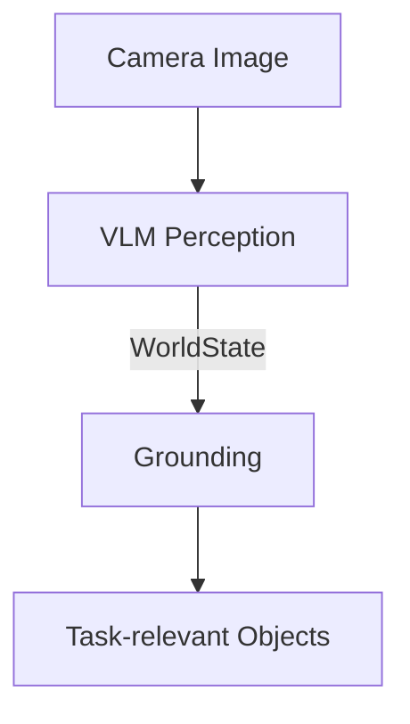

同時に、自然言語の指示を次のように構造化します。

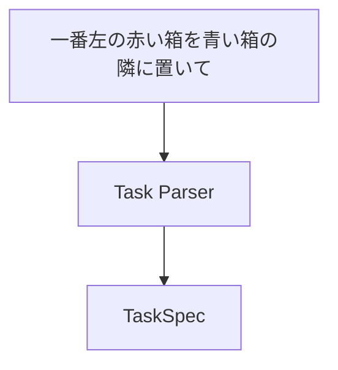

最終的には、

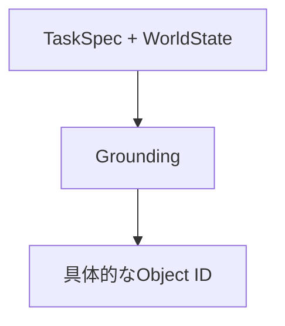

まで変換できることを目標とします。

---

## 2. VLMをロボットの知覚に使う

VLM（Vision-Language Model）は、画像を単に分類するだけでなく、

- 何が存在するか
- どんな属性を持つか
- おおよそどこにあるか
- 自然言語で指定された対象がどれか

といったsemanticな情報を取得できます。

例えば画像から、

```text
赤い箱
青い箱
黒い障害物
```

を認識できます。

しかし、ロボットシステムの内部表現として自由文を使うのは扱いづらいため、VLMの結果を`WorldState`へ変換します。

```python
class WorldState(BaseModel):
    objects: list[WorldObject]
```

各objectには、

```text
id
type
color
bounding box
```

などを持たせます。

### ポイント

VLMは**semantic perception**として使い、後段のsoftwareが扱いやすいstructured dataへ変換します。

---

## 3. Structured Output

LLM/VLMにJSONを「それっぽく」生成させるだけでは、fieldの欠落や型の違いが発生します。

そこでStructured OutputとPydantic schemaを利用します。

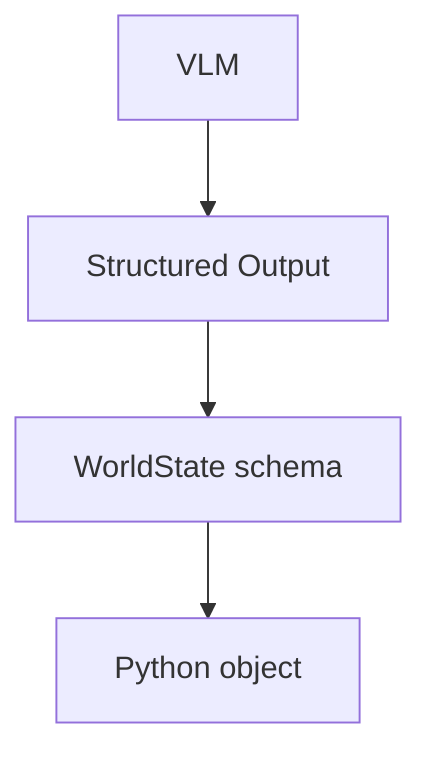

これにより、

```text
colorは定義されたEnumのみ
bboxにはcenter / width / heightが必要
width / heightは正の値
```

といった構造上の制約を持たせられます。

ただし重要なのは、

> **Schema valid ≠ Semantically correct**

という点です。

例えば、

```json
{
  "color": "red",
  "x": 500
}
```

がschema上正しくても、本当に画像上の赤い箱がその位置にあるとは限りません。

Structured OutputはAIの出力を**安全に扱いやすくする仕組み**であって、認識そのものの正しさを保証するものではありません。

---

## 4. VLMとGeometry

VLMはbounding boxやobject centerを推定できます。

しかし実験すると、

- object centerは比較的正確
- bounding boxはおおよその位置として使える
- object形状によってwidth / heightの誤差が生じる

といった特徴が確認できます。

したがってVLMのgeometryは、

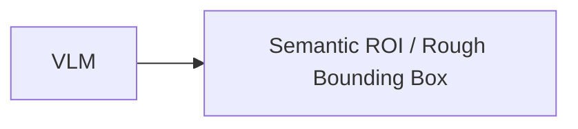

として扱うのが安全です。

精密なロボット操作では、

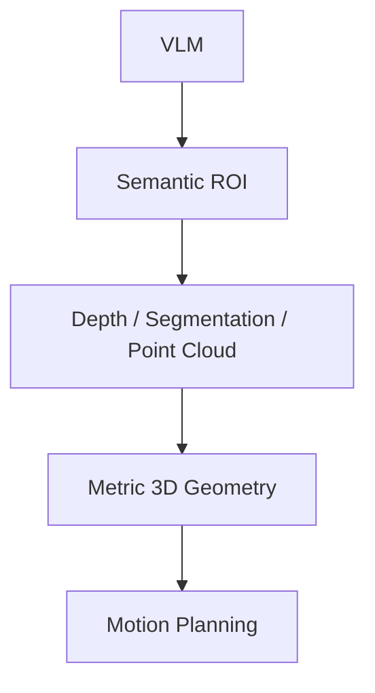

のように、後段のperceptionと組み合わせます。

### Coordinate Contract

位置を扱うときは、

```text
pixel coordinateなのか
normalized coordinateなのか
camera frameなのか
world frameなのか
```

を明示する必要があります。

数値だけを渡す設計は、ROSで`frame_id`なしの座標を渡すのと同じ問題を持ちます。

---

## 5. TaskSpec

ユーザーの自然言語指示も、そのまま後段へ渡さずstructured representationへ変換します。

例えば、

```text
"赤い箱を青い箱の隣に置いて"
```

を、

```text
action     = PLACE
object_ref = "赤い箱"
target_ref = "青い箱"
relation   = NEXT_TO
```

という`TaskSpec`へ変換します。

ここで重要なのは、`TaskSpec`のreferenceはまだ、

```text
"赤い箱"
```

という**semantic reference**だということです。

まだ具体的な`obj_3`などには変換しません。

---

## 6. Grounding

Groundingは、

> 自然言語上のreferenceを、WorldState上の具体的なentityへ対応付ける

処理です。

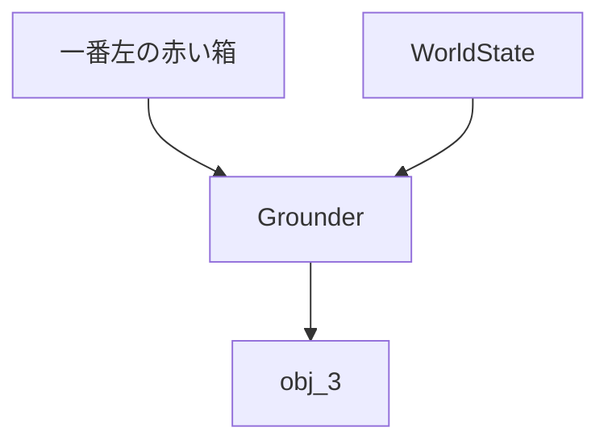

Grounding結果には少なくとも、

```text
RESOLVED
NOT_FOUND
AMBIGUOUS
```

を持たせます。

例えば、

```text
赤い箱が1個
→ RESOLVED

赤い箱が存在しない
→ NOT_FOUND

赤い箱が2個あり区別できない
→ AMBIGUOUS
```

となります。

Groundingできなかった場合は、後段のPlannerへ進ませないことが重要です。

---

## 7. Object Identity

VLMが検出したobjectにstable IDを持たせる責務は、本来VLMにはありません。

実システムでは、

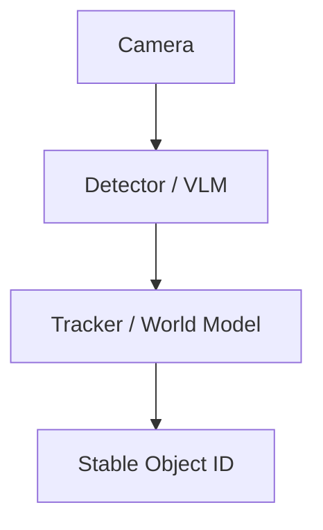

という構成が考えられます。

つまり、

```text
Perception = WHAT EXISTS
Grounding   = WHICH ENTITY
Tracking    = WHICH PHYSICAL OBJECT OVER TIME
```

は別の問題です。

簡単なlabでは検出後に`obj_0`, `obj_1`などを割り当てても構いませんが、それがframe間でstableではないことを理解しておく必要があります。

---

## 8. Grounding Contract

Grounderは、要求されたreferenceごとに結果を返すようにします。

```text
Input:
  "一番左の赤い箱"
  "青い箱"

Output:
  "一番左の赤い箱" → RESOLVED(obj_0)
  "青い箱"         → NOT_FOUND
```

各結果に元の`ref`を持たせることで、

```text
requested refs
      ==
returned refs
```

をdeterministicに検証できます。

これはLLMをrobotics systemへ組み込むときの基本原則につながります。

```text
Prompt
  ↓
期待するbehaviorを伝える

Schema
  ↓
出力構造を制約する

Validator
  ↓
システム上必要なsemantic invariantを検証する
```

---

## 9. Day 1 Architecture

Day 1終了時点では、次の責務分離になります。

```text
                    ┌─────────────┐
Instruction ───────▶│ Task Parser │
                    └──────┬──────┘
                           │ TaskSpec
                           ▼

Image ─────────────▶ VLM Perception
                           │
                           │ WorldState
                           ▼
                       Grounder
                           ▲
                           │ semantic refs
                           │
                        TaskSpec
                           │
                           ▼
                   GroundingResults
```

### Day 1で覚えておくこと

1. VLMの自由文をそのままrobot systemへ渡さない
2. Structured Outputで明示的なcontractを作る
3. Schema validityとsemantic correctnessを区別する
4. VLM geometryはrough semantic geometryとして扱う
5. Task ParsingとGroundingを分離する
6. Stable identityはTracker / World Modelの責務
7. AI outputの後にはdeterministic validationを置く

---

# Day 2 — System2・Skill Planning・Robot Runtime

## 10. この章のゴール

Day 2では、Day 1で作ったstructured representationを使って、

```text
自然言語
 ↓
理解
 ↓
計画
 ↓
Robot Skill
 ↓
実行
 ↓
失敗
 ↓
Recovery
```

までを接続します。

重要なテーマは、

> **System2のsemantic reasoningとRobot Runtimeを分離する**

ことです。

---

## 11. System2とRobot Runtime

LLMは複雑な状況をsemanticにreasoningできます。

しかし、

- latencyが大きい
- execution timeが一定ではない
- 出力が確率的
- APIやnetworkに依存する場合がある

ため、low-level robot controlには向きません。

そこで、

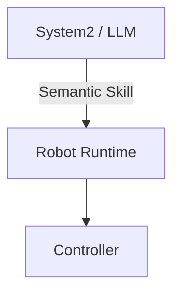

という境界を作ります。

System2には、

```text
PICK
PLACE
NAVIGATE
INSPECT
```

のようなskillを選ばせます。

joint velocityやmotor torqueを直接生成させるわけではありません。

---

## 12. Skill Catalog

LLMがskillを適切に選ぶには、そのskillが何を意味するかを知る必要があります。

そこでSkill Catalogを用意します。

例えば、

```text
PICK

Purpose:
  指定されたobjectを把持する

Parameters:
  target_id

Preconditions:
  gripperが空
  targetが利用可能

Effects:
  targetを保持する
```

のように記述します。

Skill Plannerには、

```text
TaskSpec
WorldState
GroundingResults
Skill Catalog
```

を渡します。

これによりSystem2は、

```text
PICK(obj_0)
PLACE(obj_0, NEXT_TO, obj_2)
```

のようなSkillPlanを生成できます。

---

## 13. SkillPlan

SkillPlanは、

> **何を、どの順番で実行するか**

を表します。

```text
SkillPlan
 ├─ PICK(obj_0)
 └─ PLACE(
      object=obj_0,
      relation=NEXT_TO,
      reference=obj_2
    )
```

Skillごとにparameter schemaを分けることで、

```text
PICK + PickParameters
PLACE + PlaceParameters
```

という対応関係を型として表現します。

LLMが生成するschemaは、可能な限り「不正な組み合わせを表現しにくい」設計にします。

---

## 14. Plan Validation

LLMが生成したSkillPlanは、そのままRobot Runtimeへ送信しません。

間にdeterministicなPlan Validatorを置きます。

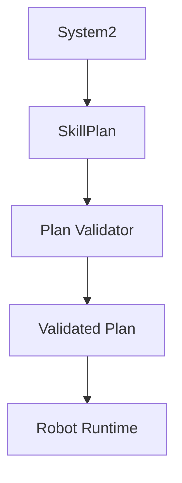

Validatorでは例えば、

### Reference Integrity

```text
target_idがWorldStateに存在するか
```

### Skill Preconditions

```text
すでにobjectを持っている状態で
別のPICKをしていないか
```

### Skill Effects

```text
PICK(obj_0)
 ↓
holding = obj_0

PLACE(obj_0)
 ↓
holding = None
```

などをvirtualに実行します。

これにより、

```text
PLACEだけのplan
```

などを実行前にrejectできます。

---

## 15. ExecutabilityとGoal Satisfaction

Plan Validationでは、2つの概念を区別する必要があります。

```text
Executability
= このplanを実行できるか

Goal Satisfaction
= このplanでユーザーのgoalを達成できるか
```

例えば、

```text
PICK(green)
PLACE(green, NEXT_TO, red)
```

が実行可能でも、

```text
"赤を青の隣に置いて"
```

というgoalは達成しません。

したがってproduction systemでは、

```text
Plan Validator
Goal Validator
```

あるいは同等の仕組みが必要になります。

---

## 16. SkillRequest

SkillPlanはSystem2側のrepresentationです。

Robot Runtimeへ実際に送るときは`SkillRequest`へ変換します。

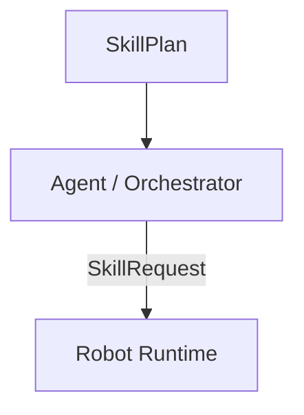

SkillRequestには、

```text
SkillStep
timeout
```

など、**今回の実行に必要な情報**を持たせます。

一方、

```text
PICKの成功条件
PLACEのprecondition
```

などskillそのものの仕様はRobot Runtime側のSkill implementationが持ちます。

これにより、

```text
Plan = WHAT TO EXECUTE

Request = EXECUTION REQUEST

Runtime = HOW TO EXECUTE
```

という責務分離ができます。

---

## 17. Robot Runtime

Robot Runtimeは、1つのSkillRequestを受け取って実行します。

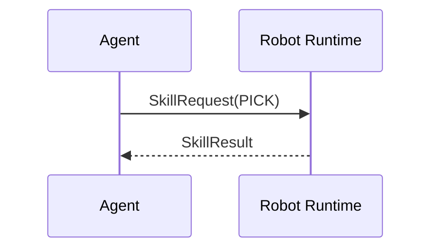

Runtime内部では将来的に、

```text
Motion Planning
VLA / Learned Policy
Controller
Sensor Feedback
Safety Check
```

などを利用できます。

重要なのはSystem2から見ると、これらを、

```text
PICK
PLACE
```

というstableなinterfaceの後ろへ隠せることです。

---

## 18. SkillResult

Robot Runtimeは実行結果をstructuredに返します。

例えば、

```text
SUCCEEDED
FAILED
TIMEOUT
CANCELLED
```

と、

```text
TARGET_UNAVAILABLE
PATH_UNAVAILABLE
ACTION_FAILED
SAFETY_VIOLATION
```

などを組み合わせます。

failure reasonの粒度は、

> **上位層のrecovery strategyが変わる粒度**

にすると扱いやすくなります。

---

## 19. Recovery

Physical AIは、一度Planを作って最後まで実行するだけでは不十分です。

現実世界は変化するため、

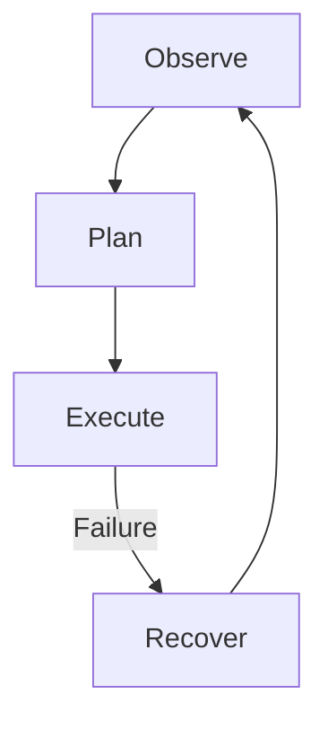

というclosed loopが必要です。

Recovery Routerでは、SkillResultから次のactionをdeterministicに選択します。

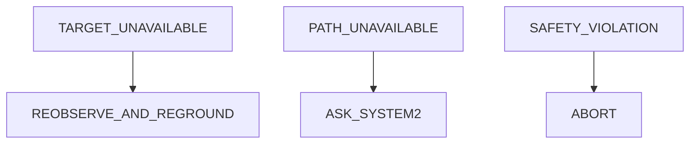

明確なrecovery strategyがあるfailureまでLLMへ渡す必要はありません。

---

## 20. Reobserve and Reground

例えばPICK中に対象が消え、

```text
TARGET_UNAVAILABLE
```

となった場合、古いWorldStateは信用できません。

そこで、

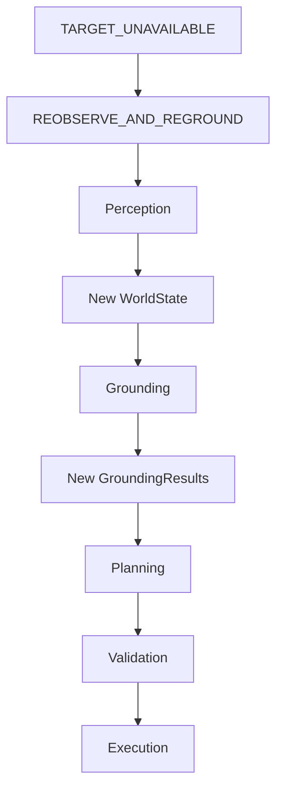

と戻ります。

一方、ユーザーのinstructionを表す`TaskSpec`は変わっていないため、Task Parsingからやり直す必要はありません。

これはデータの依存関係を考えると自然です。

```text
TaskSpec         ← goalなので保持

WorldState       ← 再生成
GroundingResults ← 再生成
SkillPlan        ← 再生成
```

---

## 21. Agent / Orchestrator

ここまでのcomponentをAgentが接続します。

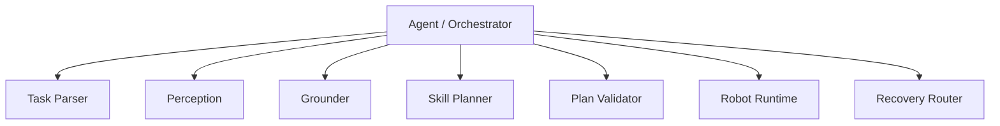

ここで重要なのは、

> **Agent = LLMではない**

ということです。

Agentは通常のsoftware orchestration layerとして、

```text
Observe
Ground
Plan
Validate
Execute
Recover
```

を管理できます。

LLMは必要なreasoningを行うcomponentの1つです。

---

# Day 2 Part 2 — Timing Boundary

## 22. なぜSystem2とRobot Runtimeを分離するのか

責務だけでなく、**時間スケール**も大きく異なります。

```text
System2 / LLM
────────────────
数百ms〜数秒
latencyが変動
non-deterministic

        ↓ Skill

Robot Runtime
────────────────
ms〜数十ms
timing requirementあり

        ↓

Controller
────────────────
さらに高速
より強いtiming requirement
```

LLMの推論が遅れたからといって、robot control loopまで停止してはいけません。

---

## 23. 100 Hz Mini-lab

10 ms周期のloopを作り、

```text
period
execution time
jitter
deadline miss
```

を測定しました。

### Period

実際のloop開始間隔。

### Execution Time

1 iterationの処理時間。

### Jitter

予定開始時刻と実際の開始時刻のずれ。

### Deadline Miss

定めたdeadlineまでに処理が完了しなかったこと。

ここで重要なのは、

> **Periodが10 msを超えたこととDeadline Missは同じではない**

という点です。

開始が少し遅れても、次のdeadlineまでに処理が終了すればdeadline missではありません。

---

## 24. Absolute Scheduling

周期loopでは、

```python
process()
time.sleep(period)
```

とすると、

```text
execution time + sleep
```

が周期になってしまいます。

そこで、

```text
next scheduled time
        -
current time
        =
sleep time
```

として、最初の基準時刻から各iterationの予定時刻を計算します。

これにより長期的なdriftを抑えられます。

ただし、

> 平均周期が正しいことと、各iterationのtimingが保証されることは別

です。

---

## 25. CPU LoadとJitter

通常のLinux上で100 Hz loopを実行すると、平均周期はかなり正確に10 msとなりました。

しかしCPU loadを加えると、最大jitterはおよそ、

```text
約1.1 ms
    ↓
約3.25 ms
```

まで増加しました。

平均periodは10 msのままでも、個々のiterationは、

```text
13 ms
7 ms
10 ms
...
```

のように揺れます。

つまり、

> **平均100 Hzで動くことと、100 Hzのtimingが保証されることは違う**

ことが分かります。

---

## 26. Real-Timeの分類

### Best-effort

できるだけdeadlineに間に合わせるが保証しない。

通常Linux上の一般的なapplicationは基本的にここです。

### Soft Real-Time

deadline missによって品質は低下するが、多少のmissは許容されます。

### Firm Real-Time

deadlineを過ぎた結果には価値がありません。ただし少数のmissが直ちにsystem failureになるとは限りません。

### Hard Real-Time

deadline missを許容できず、worst-caseを含めたtiming guaranteeが必要です。

重要なのは、

> **100 HzだからHard Real-Timeなのではない**

ことです。

Real-Time requirementはfrequencyではなく、

> **deadlineを外したとき何が起きるか**

によって決まります。

---

# 27. Day 2 Architecture

Day 2終了時点のarchitectureは次のようになります。

```text
                 Slow / Semantic / Non-deterministic
┌───────────────────────────────────────────────────┐
│                                                   │
│  User                                             │
│   ↓                                               │
│  Task Parser → TaskSpec                           │
│                 ↓                                 │
│  Perception → WorldState                          │
│                 ↓                                 │
│  Grounder → GroundingResults                      │
│                 ↓                                 │
│  Skill Planner / System2                          │
│                 ↓                                 │
│              SkillPlan                            │
│                 ↓                                 │
│            Plan Validator                         │
│                                                   │
└──────────────────────┬────────────────────────────┘
                       │
                       │ SkillStep
                       ▼
                 Agent / Orchestrator
                       │
                       │ SkillRequest
                       ▼
┌───────────────────────────────────────────────────┐
│            Robot Execution Boundary               │
│                                                   │
│              Robot Runtime                        │
│                   │                               │
│              SkillResult                          │
│                   │                               │
└───────────────────┬───────────────────────────────┘
                    │
                    ▼
              Recovery Router
               /      |      \
              /       |       \
      REOBSERVE   ASK_SYSTEM2   ABORT
          │
          └──────────────→ Perception
```

---

# 28. Day 1–2で身につける設計原則

この2日間で最も重要なのは、個々のAPIの使い方ではありません。

Physical AIシステムを、次の責務へ分解して考えられることです。

```text
Perception
    ↓
World Representation
    ↓
Grounding
    ↓
Reasoning / Planning
    ↓
Deterministic Validation
    ↓
Skill Interface
    ↓
Robot Runtime
    ↓
Control / Safety
```

そして各境界では、

```text
What information crosses this boundary?

Who owns this state?

What can be probabilistic?

What must be deterministic?

What happens when it fails?

What timing requirement exists?
```

を考えます。

LLM/VLMをロボットへ組み込むときに重要なのは、

> **AIにすべてを任せることではなく、AIが得意なsemantic reasoningと、robotics側が得意なgeometry・execution・control・safetyを適切なinterfaceで接続すること**

です。

Day 1–2では、そのための最小のclosed-loop Physical AI architectureを構築しました。

---

# 29. 次のステップ

ここまでは主に、

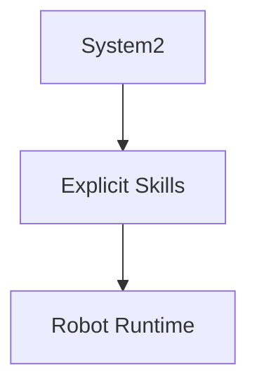

を扱いました。

次はRobot Runtime側へlearned behaviorを導入します。

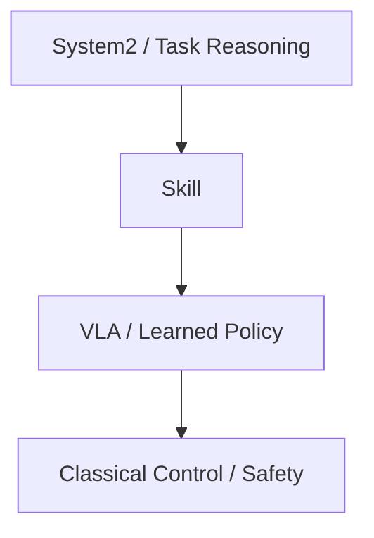

そのために次章では、

- Behavior Cloning
- Imitation Learning
- VLA
- Diffusion / Flow-based Policy
- Physical Prompting

を扱います。

Day 1–2で作ったSkill boundaryを維持したまま、

> **どの部分をlearned policyへ置き換えるとPhysical AIとして何が変わるのか**

を見ていきます。

---

# Day 3 — Robot Learning・VLA・Action Chunking

## 30. この章のゴール

Day 3では、Day 2までのRobot Runtimeに**learned policy**を導入するための基礎を学びます。

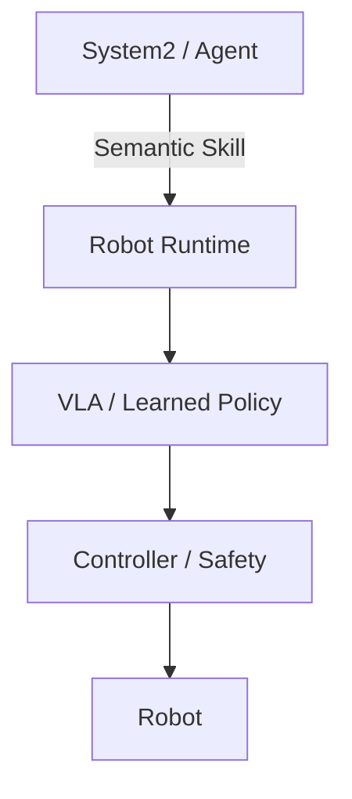

重要なのは、VLAですべてを置き換えることではありません。

Day 2で作ったSkill boundaryを維持しながら、

> **どの部分をlearned policyに任せ、どの部分をclassical roboticsに残すか**

を考えます。

---

## 31. Behavior Cloning

Behavior Cloning（BC）は、expert demonstrationから

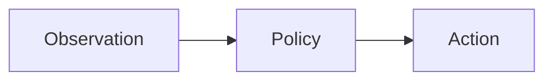

の対応をsupervised learningで学習する、最も基本的なImitation Learningです。

2D point robotのmini-labでは、

```mermaid
flowchart LR
    State["robot x,y<br/>goal x,y"] --> MLP[MLP]
    MLP --> Action["velocity x,y"]
```

を学習しました。

PyTorchでのtrainingも通常のsupervised learningと同じです。

```mermaid
flowchart LR
    Dataset[Dataset] --> Policy["Policy<br/>nn.Module"]
    Policy --> Prediction[Prediction]
    Prediction --> Loss[Loss]
    Loss --> Backward["backward()"]
    Backward --> Optimizer[Optimizer]
```

---

## 32. Distribution Shift

BCの重要な問題が**distribution shift**です。

training data上では小さなaction errorでも、closed-loopでは誤差が次の入力状態を変えてしまいます。

```mermaid
flowchart TD
    Error[Action Error]
    Error --> State[少し違うStateへ移動]
    State --> OOD[Demonstrationに少ないState]
    OOD --> LargerError[Prediction Error増大]
    LargerError --> State
```

つまりRobot Policyでは、

> **自分の出力が、次に自分が見る入力を変える**

という特徴があります。

そのため、

> **training / validation lossが小さいことと、robot taskが成功することは同じではない**

ことが重要です。

```mermaid
flowchart LR
    Offline["Offline Evaluation<br/>Loss"] --> Eval[Policy Evaluation]
    Closed["Closed-loop Evaluation<br/>Rollout / Success Rate"] --> Eval
```

DAggerはlearner自身が訪れたstateにもexpert actionを追加することで、このdistribution shiftを軽減する方法の一つです。

---

## 33. BCからVLAへ

toy BCでは、

```mermaid
flowchart LR
    State["Robot State + Goal"] --> MLP[MLP]
    MLP --> Action[Action]
```

でした。

VLA（Vision-Language-Action）では、これをより一般化します。

```mermaid
flowchart TD
    Image[Image] --> Policy[Multimodal Policy]
    Language[Language Instruction] --> Policy
    State["Robot State<br/>Proprioception"] --> Policy
    Policy --> Action[Robot Action]
```

ここで重要なのは、

- **BC** = 学習方法
- **VLA** = model / capability / input-output architecture

という違いです。

したがって両者は対立する概念ではなく、

```mermaid
flowchart LR
    Demo[Expert Demonstrations]
    Demo -->|Behavior Cloning| VLA[VLA Policy]
```

のように、VLAをBCで学習することもできます。

---

## 34. Action Representation

Robot Policyが何をactionとして出力するかは重要な設計判断です。

例えば、

- joint position / delta
- joint velocity
- end-effector pose / delta
- gripper command

などがあります。

VLAがmotor torqueまで直接生成する必要はありません。

```mermaid
flowchart TD
    VLA[VLA]
    VLA --> Target["EE Target / Joint Target"]
    Target --> IK["IK / Trajectory Generation"]
    IK --> Controller[Controller]
    Controller --> Robot[Robot]
```

このようにlearned policyとclassical roboticsを組み合わせることもできます。

---

## 35. Action Chunking

1 stepずつactionを予測する代わりに、未来の複数actionをまとめて生成する方法を**Action Chunking**と呼びます。

```mermaid
flowchart LR
    Obs["Observation t"] --> Policy[Policy]
    Policy --> Chunk["a_t<br/>a_t+1<br/>a_t+2<br/>...<br/>a_t+H"]
```

利点は、

- 時間的にcoherentなmotionを生成しやすい
- Policy inference回数を減らせる

ことです。

一方でchunkを長くすると、

```mermaid
flowchart LR
    Obs["Observation at t"] --> Prediction["Long Action Chunk"]
    Prediction --> Time[Time Passes]
    Time --> Change[Environment Changes]
    Change --> Stale[Stale Actions]
```

という問題があります。

つまり、

> **長いchunkによるcoherence / inference efficiencyと、短いreplanningによるreactivityにはtrade-offがある**

ということです。

---

## 36. Multimodal Action Distribution

単純なMSEによるBehavior Cloningでは、複数の正解行動がある場合に問題が起こります。

例えば障害物を上から避けるtrajectoryと下から避けるtrajectoryの両方がdemonstrationに存在するとします。

```mermaid
flowchart LR
    Obs[Observation] --> ExpertA[上から回避]
    Obs --> ExpertB[下から回避]

    ExpertA --> MSE[MSE Regression]
    ExpertB --> MSE

    MSE --> Mean[平均的なAction]
    Mean --> Collision[障害物方向になる可能性]
```

Robot actionはしばしば**multimodal distribution**になります。

これを扱う方法として、

- Conditional VAE
- Diffusion Policy
- Flow Matching

などがあります。

---

## 37. Diffusion Policy

Diffusion Policyではactionを直接一点回帰するのではなく、

> **observationに条件付けられたaction distribution**

を学習します。

trainingではexpert action chunkへnoiseを加えます。

```mermaid
flowchart LR
    Expert[Expert Action Chunk]
    Expert --> Noise[Add Noise]
    Noise --> Noisy[Noisy Action]
    Obs[Observation] --> Network[Neural Network]
    Noisy --> Network
    Level[Noise Level] --> Network
    Network --> Estimate["Noise / Denoising Direction"]
```

inferenceではnoiseからactionを生成します。

```mermaid
flowchart LR
    Noise[Random Noise]
    Noise --> D1[Denoise]
    D1 --> D2[Denoise]
    D2 --> D3[...]
    D3 --> Action[Action Chunk]
```

これにより、複数の妥当なtrajectoryを持つaction distributionを扱えます。

一方、複数回のnetwork evaluationが必要になるため、inference costとのtrade-offがあります。

---

## 38. Flow Matching

Flow Matchingもnoise distributionからaction distributionを生成するgenerative policyとして利用できます。

```mermaid
flowchart TD
    Current["Current Noisy Action"]
    Obs[Observation]
    Time["Time t"]

    Current --> NN[Neural Network]
    Obs --> NN
    Time --> NN

    NN --> Vector["Velocity in Action Space"]
    Vector --> Integration[ODE Integration]
    Integration --> Action[Action]
```

Neural Networkは、

> **現在のaction-space上の状態を、data distributionへどの方向に動かすか**

を表すvector fieldを学習します。

DiffusionとFlow Matchingはどちらもmultimodalなaction generationを扱えますが、生成過程やtraining objectiveが異なります。

---

## 39. TransformerとDiffusion / Flow

TransformerとDiffusion / Flowは競合する概念ではありません。

```mermaid
flowchart TD
    Inputs["Image + Language + Proprioception"]
    Inputs --> Transformer["Transformer<br/>情報処理・Multimodal Fusion"]
    Transformer --> Generator["Action Generation<br/>Regression / Diffusion / Flow"]
    Generator --> Chunk[Action Chunk]
```

つまり、

- **Transformer** = 情報を処理・融合するNeural Network architecture
- **Diffusion / Flow** = action distributionを生成するframework

という別軸の技術です。

そのため、Transformerを内部networkとして使うFlow / Diffusion Policyも構成できます。

---

## 40. Physical Prompting / In-Context Robot Learning

通常のBehavior Cloningやfine-tuningでは、demonstrationをtraining dataとしてweight updateします。

```mermaid
flowchart LR
    Demo[Demonstration]
    Demo --> Training[Training]
    Training --> Update[Weight Update]
    Update --> Policy[Adapted Policy]
```

Physical Prompting / In-Context Robot Learningでは、

```mermaid
flowchart TD
    Pretrained[Pretrained Policy] --> Inference[Inference]
    Demo["Demonstration / Physical Context"] --> Inference
    Inference --> Behavior[Adapted Behavior]
```

のように、**weight updateなしでその場のdemonstration/contextを利用する**ことを目指します。

これは家庭など、

- 家ごとに環境が違う
- objectが違う
- 配置が違う
- ユーザー固有のtaskがある

といったlong-tailな環境で特に重要になります。

ただし、

```mermaid
flowchart LR
    Demo[Physical Prompt]
    Demo --> First["Time-to-first-success"]
    Demo --> Reliable["Time-to-reliable-success"]
```

は別の評価軸です。

一度成功できることと、安定して成功できることは同じではありません。

---

## 41. LeRobot Dataset

LeRobotを使って実際のRobot Learning datasetを確認しました。

PushT datasetには、

- `observation.image`
- `observation.state`
- `action`
- `episode_index`
- `frame_index`
- `timestamp`

などがあります。

Robot Learning datasetは単なるIID sample集ではなく、trajectoryとして構造化されています。

```mermaid
flowchart TD
    Episode[Episode]
    Episode --> F0[Frame 0]
    Episode --> F1[Frame 1]
    Episode --> F2[Frame 2]
    Episode --> FN[...]

    F0 --> O0[Observation]
    F0 --> A0[Action]
```

`delta_timestamps`を使うことで、元のsingle-step action sequenceからtraining時にaction chunkを取得できます。

```mermaid
flowchart LR
    Dataset["Raw Trajectory<br/>a0,a1,a2,a3,..."]
    Dataset --> Sampling["delta_timestamps"]
    Sampling --> Chunk["a_t,a_t+1,...,a_t+H"]
```

raw datasetをaction chunkごとに重複保存する必要はありません。

---

## 42. ACT — Action Chunking with Transformers

LeRobotのACT Policyを実際に確認しました。

```mermaid
flowchart TD
    Image["observation.image"] --> Vision[ResNet18]
    State["observation.state<br/>Proprioception"] --> StateProj[State Projection]

    Vision --> Transformer[Transformer]
    StateProj --> Transformer

    Queries[Action Queries] --> Transformer

    Transformer --> Head[Action Head]
    Head --> Chunk["Action Chunk<br/>H × Action Dim"]
```

今回のlabでは、

```text
chunk_size = 100
action_dim = 2
```

なので、

```text
action.shape = [100, 2]
```

となりました。

ACTは時間方向をflattenせず、

```text
[time, action_dim]
```

として明示的に保持します。

---

## 43. ACTとCVAE

ACTではtraining時にCVAEも利用します。

```mermaid
flowchart TD
    Expert["Expert Action Chunk"] --> VAE[VAE Encoder]
    State["Robot State"] --> VAE

    VAE --> Latent["Latent z"]

    Image[Image] --> Vision[Vision Encoder]
    Vision --> Main[ACT Transformer]
    State --> Main
    Latent --> Main

    Main --> Chunk[Predicted Action Chunk]
```

latent variableによってdemonstration中のvariationを表現できます。

ACTは単純なMSE BCより豊かなaction sequenceを扱えますが、Diffusion Policyとは異なるgenerative mechanismです。

---

## 44. Toy BCからLeRobot ACTまで

最初に自作したtoy BCとLeRobotのACTは、規模こそ大きく異なりますが、trainingの基本構造は同じです。

```mermaid
flowchart LR
    Dataset[LeRobotDataset]
    Dataset --> Temporal[Temporal Sampling]
    Temporal --> Loader[DataLoader]
    Loader --> ACT[ACTPolicy]
    ACT --> Loss[Loss]
    Loss --> Backward["backward()"]
    Backward --> Optimizer[Optimizer]
```

Policy内部が、

```mermaid
flowchart LR
    Toy["Toy BC"] --> MLP[MLP]

    Real["ACT"] --> Vision[Vision Encoder]
    Real --> Transformer[Transformer]
    Real --> CVAE[CVAE]
    Real --> Chunk[Action Chunk Decoder]
```

へ高度化しているだけで、根底には同じPyTorchのtraining loopがあります。

> **Dataset → Tensor → nn.Module → Loss → Backpropagation**

---

# 45. Day 3で覚えておくこと

1. Behavior Cloningはexpert demonstrationからobservation→actionを学習する
2. Robot Policyではclosed-loop distribution shiftが重要
3. offline lossだけでなくrollout / task successで評価する
4. BCは学習方法、VLAはmodel / capabilityであり両立する
5. Proprioceptionは画像とは別の重要なrobot state input
6. Action Chunkingは複数stepのactionをまとめて予測する
7. chunk lengthにはefficiency / coherenceとreactivityのtrade-offがある
8. Robot actionはmultimodalになり得る
9. Diffusion / Flowはaction distributionを生成する方法
10. TransformerはDiffusion / Flowとは別軸のarchitecture
11. Physical Promptingはweight updateなしで現場のcontextを利用する方向性
12. LeRobotはDataset・temporal sampling・Policyを共通interfaceで扱える
13. ACTはVision + Proprioception + Transformer + CVAE + Action Chunkingを組み合わせる
14. Learned PolicyはRobot Runtime / Safety / Controllerと組み合わせて使う

---

# 46. Day 3終了時点のArchitecture

Day 1〜3を統合すると、現在のPhysical AI architectureは次のようになります。

```mermaid
flowchart TD
    User[User Instruction]

    subgraph Slow["Slow / Semantic / System 2"]
        Parser[Task Parser]
        Perception[VLM Perception]
        Grounder[Grounder]
        Planner["Skill Planner / System2"]
        Validator[Plan Validator]
    end

    subgraph Runtime["Robot Runtime"]
        Router[Skill Router]
        Classical["Classical Skill<br/>Planning / IK"]
        Learned["Learned Skill<br/>VLA / ACT"]
    end

    subgraph Fast["Fast / Robot Execution"]
        Safety[Safety Layer]
        Controller[Controller]
        Robot[Robot]
    end

    User --> Parser
    Parser --> Planner

    Perception --> Grounder
    Grounder --> Planner

    Planner --> Validator
    Validator -->|Semantic Skill| Router

    Router --> Classical
    Router --> Learned

    Classical --> Safety
    Learned -->|Action Chunk| Safety

    Safety --> Controller
    Controller --> Robot

    Robot -->|Sensor Observation| Perception
```

Day 3ではDay 2のSkill boundaryの下へlearned policyを導入しました。

最終的なポイントは、

> **「LLM → VLA → Robot」という一本の巨大AIにするのではなく、semantic reasoning・learned skill・classical robotics・control / safetyを異なる責務と時間スケールで組み合わせる**

ことです。

これで、

```mermaid
flowchart LR
    D1["Day 1<br/>Perception / Grounding"]
    D2["Day 2<br/>System2 / Skill / Runtime"]
    D3["Day 3<br/>Robot Learning / VLA"]

    D1 --> D2 --> D3
```

まで接続できました。
