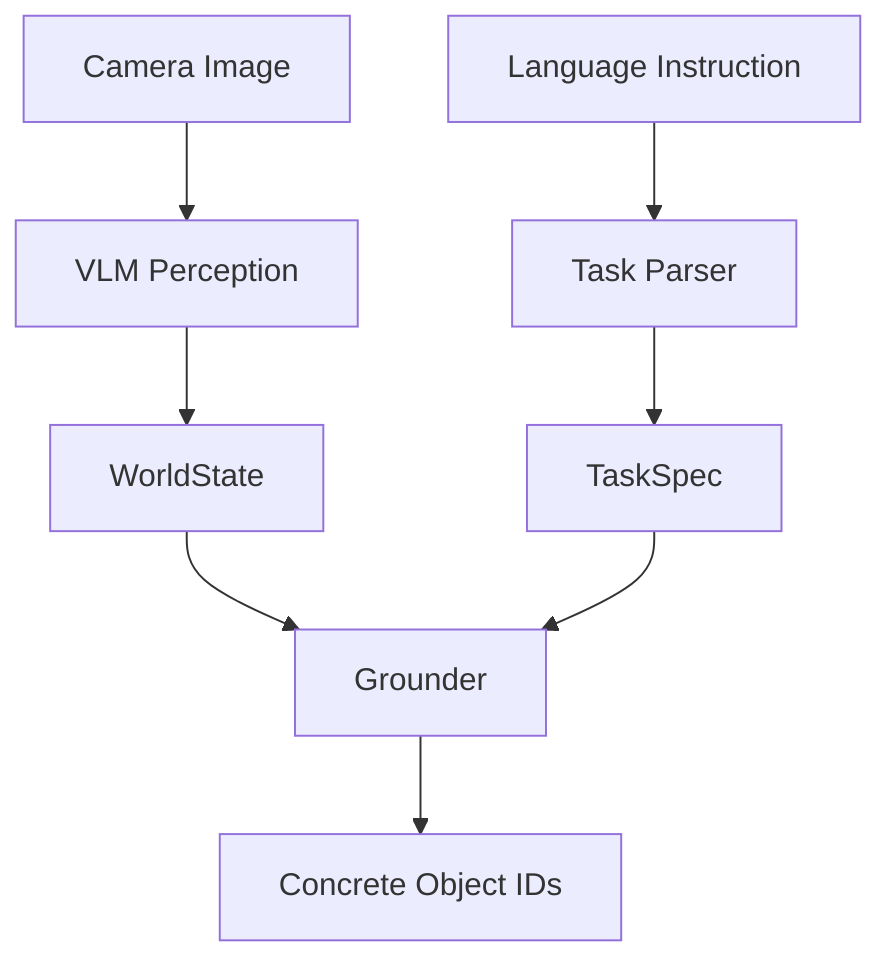
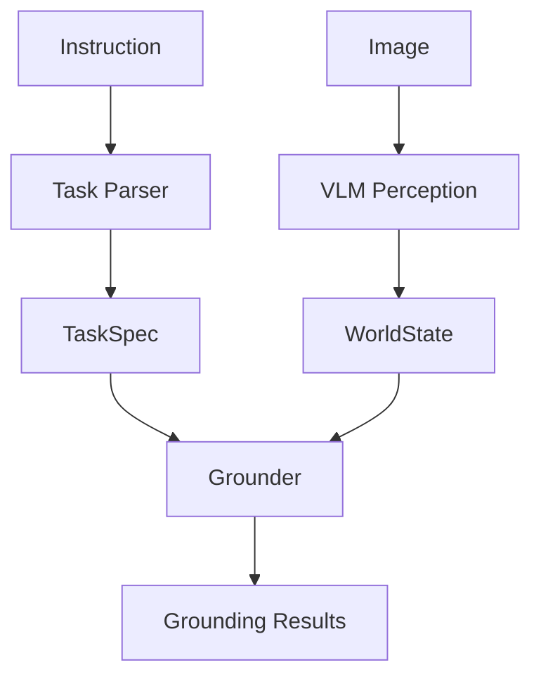
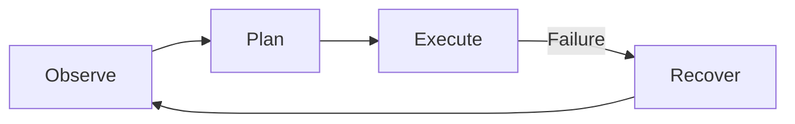
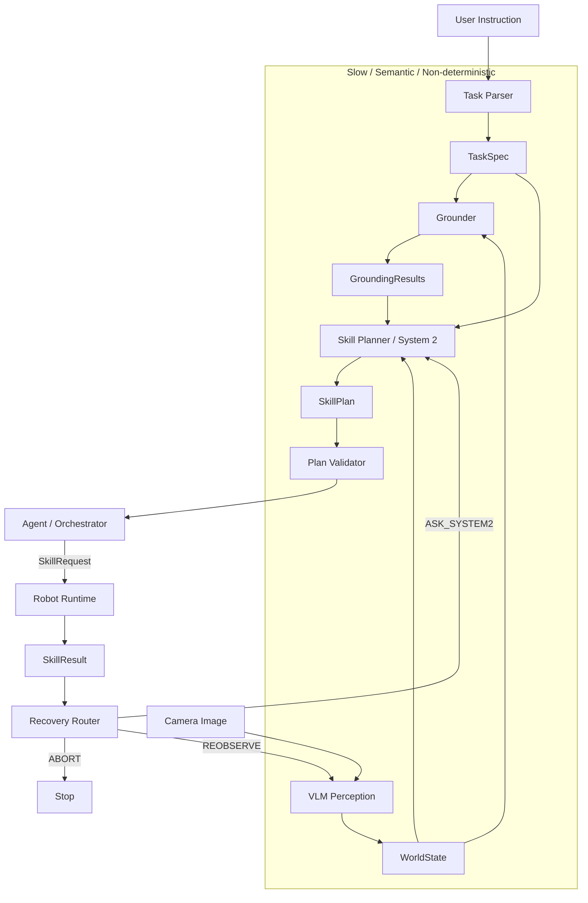
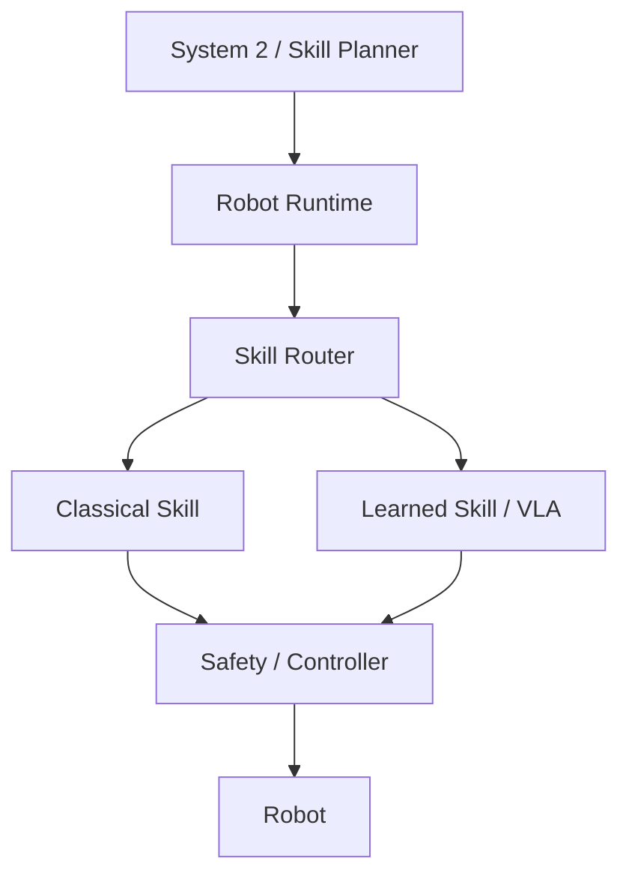
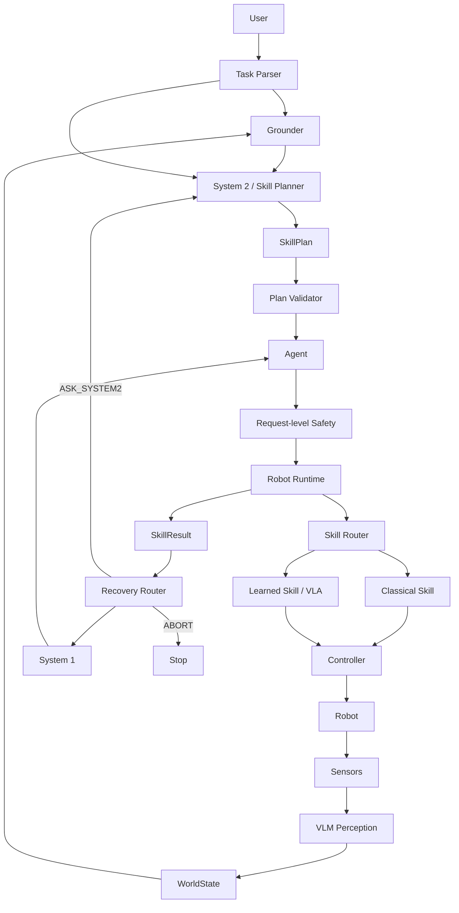

English | [日本語](textbook.ja.md)

# Physical AI Hands-on Textbook

A five-day introduction to Physical AI architecture, from VLM perception and grounding to skill planning, Robot Runtime, robot learning, recovery, and safety boundaries.

> [!NOTE]
> This English edition is an adapted, condensed translation of the original [Japanese textbook](textbook.ja.md). It preserves the full Day 1–5 curriculum and section numbering rather than translating every sentence literally. The Japanese edition is the source of truth; if the two editions differ, refer to it.

> [!WARNING]
> This repository is experimental software for education and research. It is not a safety-certified control system. The current Robot Runtime is fake, and runtime/control safety mechanisms such as speed and force limits, collision avoidance, and emergency stops are not implemented.

## About this textbook

### How this textbook was created

The textbook was generated with ChatGPT from the author's history of learning and experimentation through conversations with ChatGPT. The author reviewed the material for publication and edited its organization and wording.

Nearly all code in the repository was written by the author, with occasional AI-assisted code completion and generation of simple logic. The author has reviewed the code included in the repository.

AI-generated prose can contain inaccurate or incomplete explanations. If you find an error or an opportunity for improvement, please open an Issue or Pull Request. The repository owner is responsible for selecting, editing, and publishing the material.

The English edition was also produced with assistance from ChatGPT and reviewed and edited by the repository owner.

### Intended audience

- Readers who can follow basic Python
- Engineers exploring how LLMs and VLMs fit into robot systems
- Learners who want to study software boundaries before using a simulator or real robot

Basic familiarity with PyTorch, Pydantic, or robotics is helpful but not required. ROS 2 and physical hardware are not needed for these labs.

### Learning roadmap

| Day | Topic | Outcome |
|---|---|---|
| 1 | VLMs, grounding, structured world models | Convert images and language into explicit schemas |
| 2 | System 2, skill planning, Robot Runtime | Separate semantic reasoning from execution |
| 3 | Robot learning, VLAs, action chunking | Place learned policies behind a skill boundary |
| 4 | Hybrid Physical AI, System 1 recovery | Make bounded recovery decisions from execution context |
| 5 | Safety, failure injection, evaluation | Understand request-level safety and evaluation limits |

Setup, credentials, scene generation, and runnable commands are documented in the [README](../README.md). Results from external models and latency measurements can vary by model, network, region, and date.

### Terminology

- **LLM**: Large Language Model
- **VLM**: Vision-Language Model
- **VLA**: Vision-Language-Action model
- **Grounding**: mapping a semantic reference to a concrete entity
- **System 2**: a component for slower, open-ended semantic reasoning and planning
- **System 1**: in this textbook, a component that chooses among bounded actions based on context
- **Robot Runtime**: the software boundary connecting high-level skill requests to execution

---

## Day 1 — VLMs, Grounding, and Structured World Models

Related code: [`day1/`](../day1/), [`world_state.py`](../physical_ai/world_state.py), [`grounder.py`](../physical_ai/grounder.py), and [`task_parser.py`](../physical_ai/task_parser.py).

### 1. Goal

Day 1 turns unstructured perception and language into explicit data structures.



### 2. Using a VLM for robot perception

A VLM can report what is present, describe attributes, estimate rough locations, and relate language to visible objects. Free-form descriptions are inconvenient for downstream software, so perception is converted into a `WorldState` containing typed `WorldObject` values.

### 3. Structured output

Asking a model to produce JSON does not ensure that fields and types are valid. A Pydantic schema constrains the output and makes failures explicit. However:

> Schema-valid does not mean semantically correct.

A valid bounding box may still refer to the wrong object. Structured output improves interoperability; it does not prove perception accuracy.

### 4. VLMs and geometry

In the simple synthetic scenes used here, object centers were more useful than precise box dimensions. Treat VLM geometry as a semantic region of interest, then use depth, segmentation, calibration, or point clouds when metric geometry is required.

Every spatial value needs a coordinate contract: pixel or normalized coordinates, camera or world frame, units, origin, and axis conventions.

### 5. `TaskSpec`

The instruction “place the red box next to the blue box” becomes a structured goal:

```text
action     = PLACE
object_ref = "red box"
target_ref = "blue box"
relation   = NEXT_TO
```

These are still semantic references, not concrete object IDs.

### 6. Grounding

Grounding maps each semantic reference in `TaskSpec` to an entity in `WorldState`. A result should distinguish at least `RESOLVED`, `NOT_FOUND`, and `AMBIGUOUS`. Planning must not proceed when required references are unresolved.

### 7. Object identity

Detection, grounding, and tracking solve different problems:

```text
Perception = what exists now?
Grounding  = which entity does the language refer to?
Tracking   = which physical object persists over time?
```

IDs assigned after a single VLM call are convenient for a lab but are not stable tracking IDs.

### 8. The grounding contract

Return one result for every requested reference and include the original reference in each result. Deterministic code can then verify that requested and returned references match.

The general pattern is:

```text
Prompt    -> communicate desired behavior
Schema    -> constrain output structure
Validator -> enforce semantic invariants
```

### 9. Day 1 architecture



Key lessons: keep free-form model output away from execution, separate parsing from grounding, make coordinate systems explicit, and validate AI output deterministically.

---

## Day 2 — System 2, Skill Planning, and Robot Runtime

Related code: [`agent.py`](../physical_ai/agent.py), [`skill_planner.py`](../physical_ai/skill_planner.py), [`plan_validator.py`](../physical_ai/plan_validator.py), and [`robot_runtime.py`](../physical_ai/robot_runtime.py).

### 10. Goal

Connect understanding, planning, skill execution, failure reporting, and recovery while preserving a clear boundary between semantic reasoning and robot execution.

### 11. System 2 and Robot Runtime

LLMs can reason about semantic goals but have variable latency, probabilistic outputs, and possible network dependencies. They should choose skills such as `PICK`, `PLACE`, or `NAVIGATE`, not directly generate motor torque or participate in a high-frequency control loop.

### 12. Skill catalog

A planner needs explicit documentation for every available skill: purpose, parameters, preconditions, and effects. The catalog limits the planner to capabilities the runtime actually exposes.

### 13. `SkillPlan`

A `SkillPlan` describes what to execute and in what order. Use skill-specific parameter schemas so invalid combinations are difficult to represent.

```text
PICK(obj_0)
PLACE(obj_0, NEXT_TO, obj_2)
```

### 14. Plan validation

Never send an LLM-generated plan directly to the runtime. A deterministic validator checks reference integrity, skill preconditions, and effects. It can virtually update state—for example, `PICK` sets `holding`, while `PLACE` clears it.

### 15. Executability and goal satisfaction

These are separate questions:

- **Executability**: can the plan run from the current state?
- **Goal satisfaction**: would the plan achieve the user's requested goal?

A plan can be executable while moving the wrong object.

### 16. `SkillRequest`

`SkillPlan` is the System 2 representation. `SkillRequest` is an execution request for one step, including runtime information such as a timeout.

```text
Plan    = what to execute
Request = one execution request
Runtime = how to execute it
```

### 17. Robot Runtime

Robot Runtime accepts a stable skill interface and hides motion planning, learned policies, controllers, feedback, and safety mechanisms behind it. This allows a fake, simulated, or physical backend to share the same high-level contract.

### 18. `SkillResult`

Results should be structured: status (`SUCCEEDED`, `FAILED`, `TIMEOUT`, `CANCELLED`) plus a reason such as `TARGET_UNAVAILABLE`, `PATH_UNAVAILABLE`, `ACTION_FAILED`, or `SAFETY_VIOLATION`. Reasons should be as detailed as needed to change the recovery strategy.

### 19. Recovery

Physical AI needs a closed loop rather than a one-shot plan:



Deterministic routing handles failures with obvious responses; ambiguous failures can be escalated.

### 20. Reobserve and reground

When an object disappears, the old `WorldState` is stale. Preserve the user's `TaskSpec`, then regenerate perception, grounding, and the plan.

### 21. Agent / orchestrator

The Agent is ordinary orchestration software, not necessarily an LLM. It coordinates observe, ground, plan, validate, execute, and recover. Models are replaceable components inside that loop.

### Day 2 supplement — Timing boundaries

#### 22. Why separate System 2 and Robot Runtime?

The components operate on different time scales. Semantic reasoning may take hundreds of milliseconds or seconds; skill execution and controllers have tighter timing requirements. A slow model response must not stall a control loop.

#### 23. 100 Hz mini-lab

[`day2/rt_mini_lab.py`](../day2/rt_mini_lab.py) measures period, execution time, jitter, and deadline misses for a nominal 10 ms loop. A period longer than 10 ms and a deadline miss are related but not identical measurements.

#### 24. Absolute scheduling

Sleeping for `period` after each iteration accumulates execution time and drifts. Scheduling each iteration relative to a fixed start time reduces long-term drift, although it does not guarantee every deadline.

#### 25. CPU load and jitter

The original learning session observed larger maximum jitter under CPU load while the average period stayed near 10 ms. These numbers are environment-specific; the current lab measures timing but does not generate CPU load automatically.

#### 26. Real-time classifications

Best-effort, soft, firm, and hard real-time describe the consequence of missing a deadline—not merely the loop frequency. A 100 Hz loop is not automatically hard real-time.

#### 27. Day 2 architecture



#### 28. Design principles from Days 1–2

At every boundary ask: what data crosses it, who owns the state, what can be probabilistic, what must be deterministic, how failure is represented, and what timing requirement applies.

#### 29. Next step

Day 3 keeps the skill boundary and introduces learned behavior beneath it rather than replacing the entire architecture with one model.

---

## Day 3 — Robot Learning, VLAs, and Action Chunking

Related code: [`bc_mini_lab.py`](../day3/bc_mini_lab.py), [`bc_mini_lab_action_chunking.py`](../day3/bc_mini_lab_action_chunking.py), [`lerobot_dataset_lab.py`](../day3/lerobot_dataset_lab.py), and [`lerobot_act_lab.py`](../day3/lerobot_act_lab.py).

### 30. Goal

Learn how a learned policy can implement a skill while classical robotics, validation, and safety remain explicit system components.

### 31. Behavior Cloning

Behavior Cloning learns an observation-to-action mapping from expert demonstrations with supervised learning. The toy lab trains an MLP that maps a 2D robot position and goal to a velocity.

### 32. Distribution shift

In a closed loop, each action changes the next observation. Small errors can move the robot into states absent from demonstrations and compound over time. Low validation loss therefore does not guarantee task success. DAgger addresses this by collecting expert labels on states visited by the learner.

### 33. From BC to VLA

BC is a training method; VLA describes a multimodal model or capability. A VLA can be trained with Behavior Cloning from demonstrations containing images, language, proprioception, and actions.

### 34. Action representation

A policy may output joint positions, deltas, velocities, end-effector targets, or gripper commands. It does not need to produce motor torque directly; IK, trajectory generation, and controllers can remain classical.

### 35. Action chunking

Instead of predicting one action, a policy predicts a future sequence. Longer chunks improve temporal coherence and reduce inference frequency but react more slowly to environmental changes.

### 36. Multimodal action distributions

When demonstrations contain multiple valid behaviors, MSE regression can average them into an invalid action. Conditional VAEs, diffusion policies, and flow-based methods can represent multimodal action distributions.

### 37. Diffusion Policy

Diffusion Policy learns an observation-conditioned action distribution through iterative denoising. It supports multiple valid trajectories but requires multiple network evaluations during inference.

### 38. Flow Matching

Flow Matching learns a vector field that transports noise toward the action distribution, usually integrated as an ODE. It is another generative framework for multimodal action sequences.

### 39. Transformers versus diffusion and flow

A Transformer is a neural-network architecture for processing and fusing information. Diffusion and Flow Matching are generation frameworks. They are different design axes and can be combined.

### 40. Physical prompting and in-context robot learning

Instead of updating weights for every task, in-context approaches condition a pretrained policy on demonstrations or physical context at inference time. “Time to first success” and “time to reliable success” are distinct evaluation targets.

### 41. LeRobot datasets

Robot-learning datasets are trajectories, not merely IID samples. LeRobot exposes observations, actions, episode and frame indices, and timestamps. `delta_timestamps` constructs action chunks during sampling without storing every overlapping chunk separately.

### 42. ACT — Action Chunking with Transformers

ACT combines image features, proprioception, Transformer queries, and an action head to produce a tensor shaped `[time, action_dim]`. The lab uses a chunk size of 100 and action dimension of 2.

### 43. ACT and CVAE

During training, ACT uses a CVAE latent variable to model variation in expert action sequences. This is a different generative mechanism from a diffusion policy.

### 44. From toy BC to LeRobot ACT

The internals become more sophisticated, but the training skeleton remains familiar:

```text
Dataset -> Tensor -> nn.Module -> Loss -> Backpropagation -> Optimizer
```

### 45. Day 3 takeaways

Evaluate robot policies with closed-loop rollouts, treat action representation and chunk length as system choices, and keep learned policies behind runtime and safety interfaces.

### 46. Architecture after Day 3



---

## Day 4 — Hybrid Physical AI and System 1 Recovery

Related code: [`skill_router.py`](../physical_ai/skill_router.py), [`system1_recovery.py`](../physical_ai/system1_recovery.py), [`recovery.py`](../physical_ai/recovery.py), and [`jev_recovery_benchmark.py`](../day4/jev_recovery_benchmark.py).

### 47. Goal

Integrate skill routing, execution observations, bounded System 1 decisions, deterministic retry policy, and failure injection. Request-level safety is added in Day 5.

### 48. Skill Router

The router chooses which backend implements a semantic skill—for example, classical planning or a learned policy. System 2 decides **what** to do; the router chooses **which implementation** executes it. The current static router demonstrates the boundary but is not yet wired into `Agent`.

### 49. Where System 1 belongs

This lab uses System 1 for bounded recovery after a skill fails, not as a high-frequency controller. It chooses among `RETRY`, `REPOSITION`, `REOBSERVE_AND_REGROUND`, and `ASK_SYSTEM2`.

### 50. Extending `RecoveryAction`

The deterministic Recovery Router maps clear failure reasons to actions. `ACTION_FAILED` routes to `ASK_SYSTEM1`; the router itself does not depend on a particular AI provider.

### 51. `RecoveryContext`

A generic `ACTION_FAILED` result is insufficient. Recovery also needs execution observations such as visibility, position change, reachability, contact, grasp quality, retry count, and the current world state.

> A capable model cannot make a good decision when required state never crosses the interface.

### 52. What does “give the AI everything” mean?

Passing a structured `WorldState` is different from sending every raw image, point cloud, transform, log, and sensor history. Robotics software should estimate structured state first, then expose enough context for the decision while controlling latency and irrelevant information.

### 53. Jev as System 1 recovery

The lab uses the external Jev service as one implementation of `System1Recovery`. The Agent only calls `decide(context)`, keeping provider-specific APIs behind the interface. Running it sends `RecoveryContext` data to an external API; review the provider's current terms and data policy first.

### 54. Jev recovery mini-benchmark

Four scenarios probe expected behavior: a transient grasp failure, a moved target, an unreachable target, and repeated failure. The recorded run matched three of four expectations. This is a behavior probe, not a statistically meaningful accuracy benchmark, and results can change across model versions and runs.

### 55. System 1 versus deterministic policy

Retry limits, timeouts, and safety constraints must be deterministic when they are mandatory. Use System 1 for contextual choices within those hard boundaries.

### 56. System 1 latency

The recorded warm run produced roughly 200–300 ms decisions. This is fast relative to some open-ended planning calls but far too slow for a 10 ms control loop. “Faster AI” and “real-time control” are different concepts.

### 57. Robot Runtime outcomes

`SkillExecutionOutcome` combines a structured `SkillResult` with an optional `ExecutionObservation`, allowing the Agent to know both what failed and what was observed at failure time.

### 58. Fake Robot Runtime with failure injection

The fake runtime deliberately fails the first `PICK` and succeeds on the second attempt. This makes `Failure -> Recovery -> Retry -> Success` testable without a robot and preserves the boundary for future simulated or physical backends.

### 59. Integrating System 1 recovery into the Agent

The Agent routes failure, enforces a deterministic retry limit, builds `RecoveryContext`, calls System 1 when appropriate, and either retries, reobserves, escalates, or aborts.

### 60. End-to-end recovery in the Pick & Place demo

“End-to-end” here means from perception through the repository's recovery path. Physical PICK and PLACE are simulated by `FakeRobotRuntime`; this is not a real-robot demonstration.

---

## Day 5 — Safety, Failure Injection, and Evaluation

Related code: [`safety_supervisor.py`](../physical_ai/safety_supervisor.py), [`agent.py`](../physical_ai/agent.py), and [`robot_runtime.py`](../physical_ai/robot_runtime.py).

`SafetySupervisor` is a prototype for explaining request-level validation. It does not make the system safe by itself.

### 61. Request-level safety gate

Before a request reaches Robot Runtime, the prototype verifies that a `PICK` target exists in `WorldState`. The class is named `SafetySupervisor`, but this check is only one small request-level guard.

### 62. Robot Runtime is not the robot

Robot Runtime is a software boundary. A future implementation may connect through ROS 2 and drivers to Gazebo or a physical robot without changing the high-level Agent contract.

### 63. Request safety and runtime safety

Request safety asks whether a skill request is permitted and consistent. Runtime/control safety monitors speed, force, human distance, joint limits, collisions, and emergency stops during execution. Only the minimal request-level check exists here.

### 64. A shared failure path for safety rejection

Convert a rejected safety decision into a structured `SAFETY_VIOLATION` result and pass it through the same Recovery Router used for runtime failures. This keeps failure handling uniform.

### 65. Safety failure injection

The lab forces a rejection and verifies the software path `SAFETY_VIOLATION -> ABORT`. A safety violation is handled by deterministic policy rather than asking System 1 or System 2 to override it.

### 66. What should AI decide?

```text
Deterministic logic -> safety constraints, retry limits, timeouts, schemas
System 1           -> bounded situational recovery choices
System 2           -> open-ended reasoning and replanning
```

### 67. Evaluation

The current evaluation checks architecture behavior: normal completion, recovery success, safety stop, retry limits, escalation behavior, and latency. The four-case probe is not a general model benchmark.

### 68. Sim2Real concerns

Real observations include perception error, identity errors, depth noise, dynamics mismatch, friction, contact uncertainty, sensor and communication latency, and actuator error. Real systems often need confidence, uncertainty, history, and hysteresis rather than clean booleans.

### 69. Final architecture for Days 1–5



ROS 2, Gazebo, physical hardware, real skill backends, and runtime/control safety are future directions, not current implementations.

### 70. Separation by time scale

Semantic reasoning, bounded decisions, skill execution, controllers, and hardware operate at different rates. Design each as a separate timing boundary instead of labeling every non-LLM component “fast.”

### 71. Days 4–5 takeaways

Keep model providers behind interfaces, provide recovery with execution context, enforce mandatory policies deterministically, treat safety as layered, and evaluate failure paths as well as nominal task success.

---

## 72. Completion of the foundational architecture

The five days build a closed-loop architecture from perception and grounding through System 2 planning, validated skills, runtime execution, System 1 recovery, and request-level safety. Physical AI is not simply connecting an LLM or VLA directly to a robot; it is the explicit composition of learned and deterministic components with different responsibilities, failure modes, and time scales.

## 73. Next step — integrating a simulated or physical robot

Replace `FakeRobotRuntime` with a ROS 2 implementation, first targeting Gazebo and later physical hardware. Then replace generated images with sensor observations and introduce real classical or learned skills. Progress from offline checks to closed-loop evaluation while adding independent runtime safety.

---

## References

- [Gemini API documentation](https://ai.google.dev/gemini-api/docs)
- [Pydantic documentation](https://docs.pydantic.dev/latest/)
- [LeRobot documentation](https://huggingface.co/docs/lerobot/)
- [Learning Fine-Grained Bimanual Manipulation with Low-Cost Hardware (ACT)](https://arxiv.org/abs/2304.13705)
- [Diffusion Policy: Visuomotor Policy Learning via Action Diffusion](https://arxiv.org/abs/2303.04137)
- [Flow Matching for Generative Modeling](https://arxiv.org/abs/2210.02747)
- [A Reduction of Imitation Learning and Structured Prediction to No-Regret Online Learning (DAgger)](https://proceedings.mlr.press/v15/ross11a.html)
- [ROS REP 105: Coordinate Frames for Mobile Platforms](https://www.ros.org/reps/rep-0105.html)

## License

Unless otherwise noted, this textbook is available under the repository's [MIT License](../LICENSE). External APIs, dependencies, models, and datasets remain subject to their own terms.
